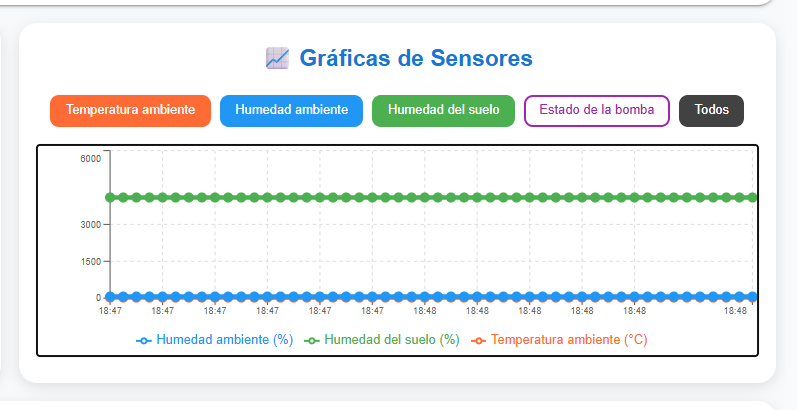
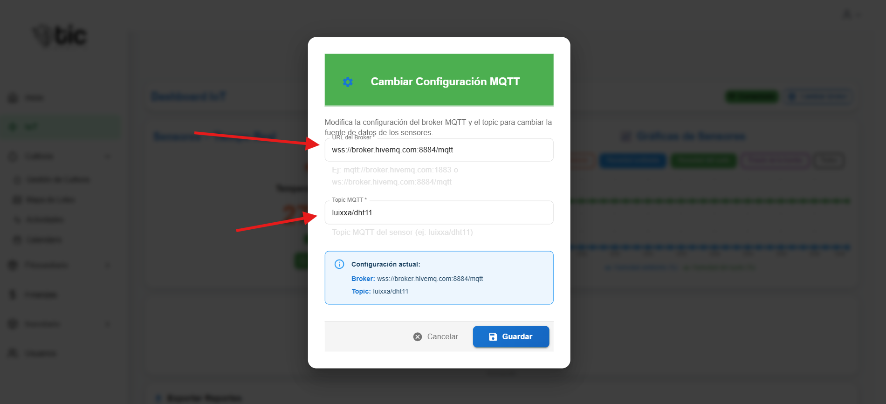

## Introducción
- El módulo IoT muestra datos en tiempo real de los sensores del cultivo y permite acciones básicas de control.
- Verás lecturas de temperatura, humedad del aire, humedad del suelo y el estado de la bomba de riego.
- Puedes consultar gráficas, exportar reportes y operar interruptores si tu perfil lo permite.

## Vista principal
- Tarjetas de sensores:
  - Temperatura ambiente (°C)

  - Humedad ambiente (%)
  
  - Humedad del suelo (%)
  
  - Bomba de riego (estado ENCENDIDA/APAGADA)
  
- Indicadores de actividad:
  - Cada tarjeta muestra su valor actual y si está ACTIVO o INACTIVO.
- Controles:
  - Interruptores para “Sistema” y “Bomba”. Úsalos para encender/apagar.
  
  - Si el control está deshabilitado, espera a recibir datos o verifica tus permisos.
- Gráficas:
  - Filtros para ver “Temperatura”, “Humedad ambiente”, “Humedad del suelo” o “Todos”.
  
  - Las curvas se actualizan con datos reales; si no hay datos, verás un aviso de espera.
  
- Configuración (informativa):
  - Oprime cambiar brocker
  

  - Verás el broker y el tópico MQTT actuales. Cambiarlos requiere soporte del sistema.
  

- Reportes:
  - Botones para descargar PDF o Excel con datos históricos.
  
## Cómo usar los controles
- Sistema:
  - Enciende o apaga el sistema general de lecturas/control.
- Bomba:
  - Activa o desactiva la bomba de riego. Úsalo con precaución.
- Si no se aplican los cambios:
  - Verifica tu conexión y vuelve a intentarlo.
  - Comprueba que tengas permisos suficientes en tu cuenta.

## Consejos
- Si no ves valores, espera unos segundos para que la app se conecte y reciba datos.
- Mantén el dispositivo IoT encendido para alimentar las gráficas y el estado de la bomba.
- Usa los filtros de la gráfica para comparar métricas y entender tendencias.

## Exportación de reportes
- PDF:
  - Genera un documento con las métricas disponibles y su evolución.
- Excel:
  - Descarga un archivo con los datos en tablas para análisis detallado.
- Si una descarga falla:
  - Revisa tu conexión y vuelve a intentarlo.

## Roles y permisos
- Algunos controles (como encender/apagar bomba) requieren permisos elevados.
- Si no ves los interruptores o no puedes usarlos, consulta con el administrador.

## Resolución de problemas
- No aparecen valores:
  - Verifica tu conexión a Internet.
  - Asegúrate de que el dispositivo IoT esté enviando datos.
- Controles deshabilitados:
  - Espera la llegada de datos o revisa tus permisos.
- Reportes no se descargan:
  - Intenta nuevamente y confirma que el sistema esté activo.

## Buenas prácticas
- No enciendas la bomba por períodos largos sin supervisión.
- Revisa las gráficas antes de tomar decisiones sobre riego.
- Mantén tu sesión iniciada y evita cerrar la app durante la recepción de datos.
