### Módulo de Actividades

Este modulo perimite a los usuarios tener el manejo de sus actividades y el manejo de tareas asignadas para el cuidado de los cultivos 
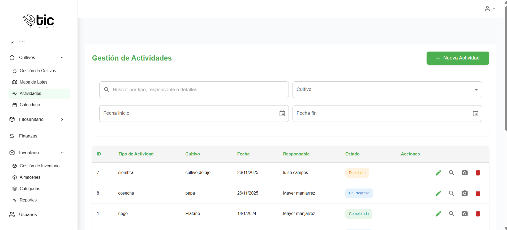

## Propósito
- Registrar, consultar, editar y eliminar actividades agrícolas por cultivo.
- Fotodocumentar actividades con imágenes y descripciones.
- Ver detalles completos de cada actividad, incluidos recursos utilizados y fotos.

## Permisos y roles
- Ver/listar (`canView`): rol `administrador`, `instructor` o permisos `actividades:ver`, `actividad:ver`, `actividades:listar`.
- Crear (`canCreate`): rol `administrador` o permisos `actividades:crear`, `actividad:crear`.
- Editar (`canEdit`): rol `administrador` o permisos `actividades:editar`, `actividad:editar`.
- Eliminar (`canDelete`): rol `administrador` o permisos `actividades:eliminar`, `actividad:eliminar`.
- Ver detalles: habilitado para `administrador` e `instructor`.
- Fotodocumentar: habilitado para `administrador` y para usuarios `aprendiz`/`pasante`.

> Si no tienes permisos de ver, se muestra el mensaje: “No tienes permisos para ver Actividades”.

## Encabezado
- Título: “Gestión de Actividades”.
- Botón `Nueva Actividad` (ícono `+`): visible si tienes permiso de crear.

  - Abre el formulario para crear una actividad.
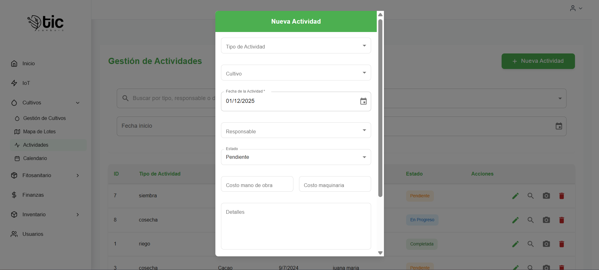

## Filtros
- Búsqueda: campo de texto con ícono de lupa para filtrar por `tipo de actividad`, `responsable` o `detalles`.
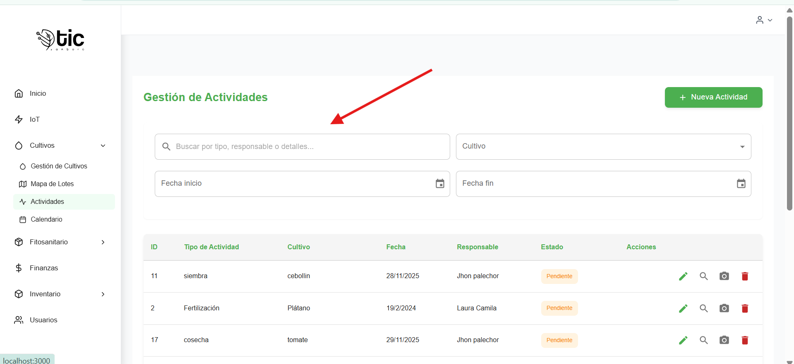

- Cultivo: selector para filtrar por cultivo específico o “Todos los cultivos”.
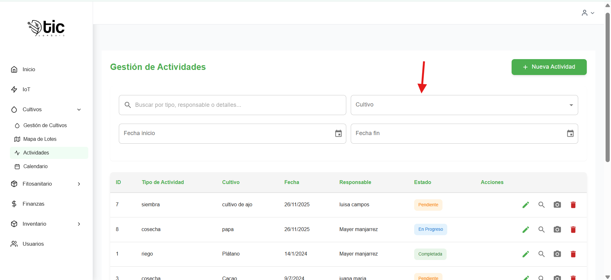

- Fecha inicio / Fecha fin: seleccionadores de rango de fechas.

Notas de uso:
- Los filtros se aplican automáticamente al cambiar los valores.
- La tabla se actualiza en función de `id_cultivo`, `fecha_inicio` y `fecha_fin`.

## Tabla de actividades
- Columnas: `ID`, `Tipo de Actividad`, `Cultivo`, `Fecha`, `Responsable`, `Estado`, `Acciones`.
- Estado: se muestra como `Chip` con color y fondo según:
  - `Pendiente` (naranja), `En Progreso` (azul), `Completada` (verde), `Cancelada` (rojo).

### Acciones por fila
- Editar (ícono lápiz): abre el formulario con los datos precargados. Requiere permiso de editar.
- Ver detalles (ícono lupa): muestra un modal con información completa y última foto. Visible para `administrador` e `instructor`.
- Fotodocumentar (ícono cámara): abre el modal para subir una imagen y descripción. Visible para `administrador`, `aprendiz`/`pasante`.
- Eliminar (ícono papelera): abre modal de confirmación y elimina la actividad al confirmar. Requiere permiso de eliminar.

## Modal: Formulario de Actividad (`ActivityFormModal`)
- Título: “Nueva Actividad” o “Editar Actividad”.
- Campos:
  - `Tipo de Actividad`: selector (`Siembra`, `Riego`, `Fertilización`, `Poda`, `Cosecha`, `Otro`).

  - `Cultivo`: selector de cultivo.
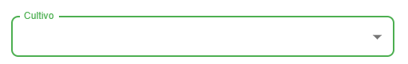

  - `Fecha de la Actividad`: selector de fecha.
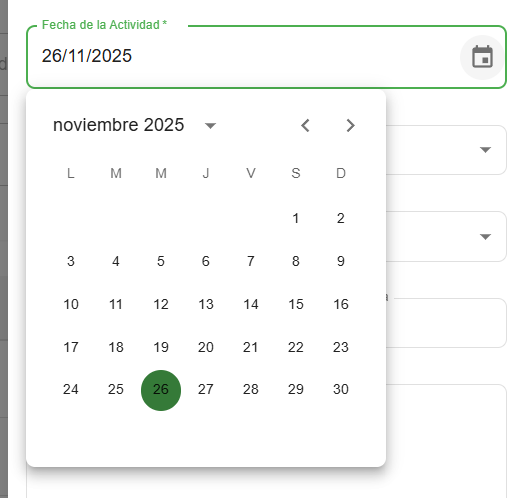

  - `Responsable`: selector de usuario (se guarda `responsable_id` y nombre).

  - `Estado`: selector (`pendiente`, `en_progreso`, `completada`, `cancelada`).
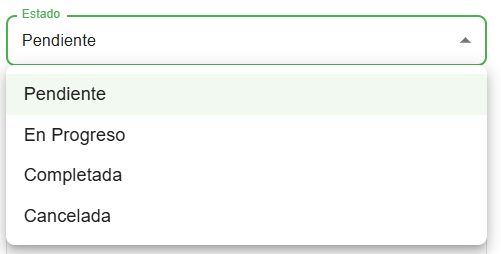
  
  - `Costo mano de obra` y `Costo maquinaria`: numéricos opcionales.
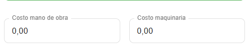

  - `Detalles`: texto libre.
  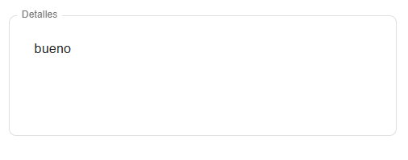
  - `Recursos utilizados`:
    - Tipo (`Consumible` / `Herramienta`).
    - `Insumo` (lista de insumos).
    - Si es `Herramienta`: `Horas uso`.
    - Si es `Consumible`: `Cantidad`.
    - `Costo unitario`.
    - Botón `Eliminar` recurso y botón `Agregar recurso`.
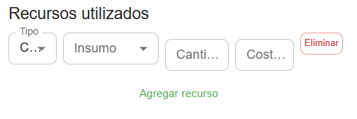
  
- Validaciones:
  - Requeridos: `tipo_actividad`, `fecha`, `responsable`, `cultivo`.
  - Se muestran mensajes de error bajo cada campo.

- Botones:
  - `Cancelar`: cierra el modal sin guardar.
  - `Crear Actividad` / `Actualizar`: guarda los cambios; muestra spinner si está guardando.

  

## Modal: Detalle de Actividad (`ActivityDetailModal`)
- Muestra: tipo, fecha, responsable, detalles, estado (Chip), recursos utilizados y fotodocumentación.

- Fotodocumentación: muestra la última foto disponible con su descripción; si la imagen falla con URL absoluta, se intenta la ruta relativa.
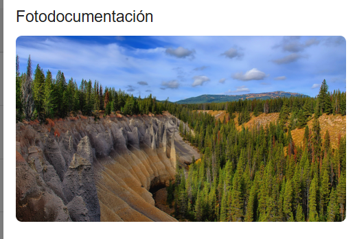

- Botón `Cerrar`: cierra el modal.
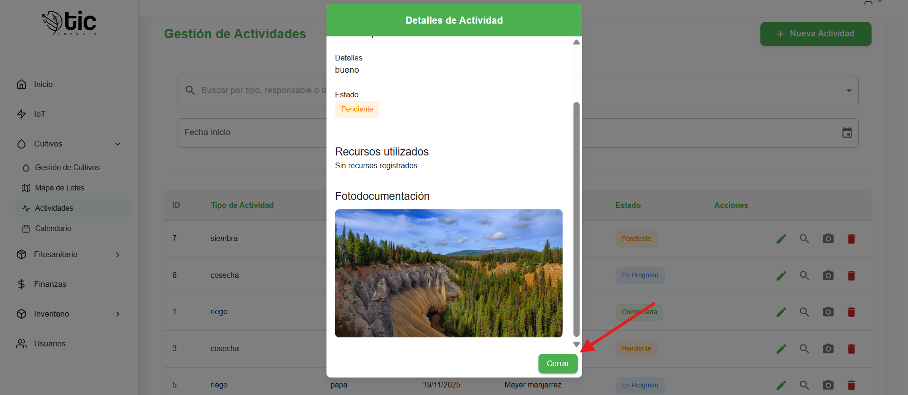

## Modal: Fotodocumentación (`PhotoUploadModal`)
- Acciones:
  - `Seleccionar Imagen`: permite cargar `png`, `jpeg`, `jpg`.
  - Vista previa de la imagen seleccionada.

  - Campo `Descripción` (requerido).

  - `Guardar`: sube la foto con validación.
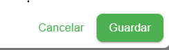
  - `Cancelar`: limpia el formulario y cierra.
- Restricciones:

  - Tamaño máximo: 5MB. Si se excede, se muestra error.
  - `Descripción` obligatoria.

- Notificaciones: muestra éxito o error al subir.
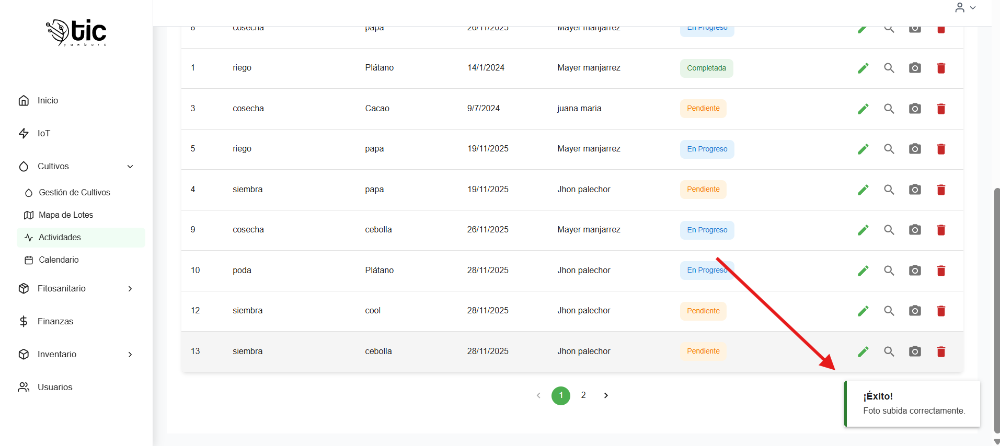

## Eliminación con confirmación (`ConfirmModal`)
- Título: “Eliminar Actividad”.
- Mensaje de confirmación con el `tipo_actividad`.
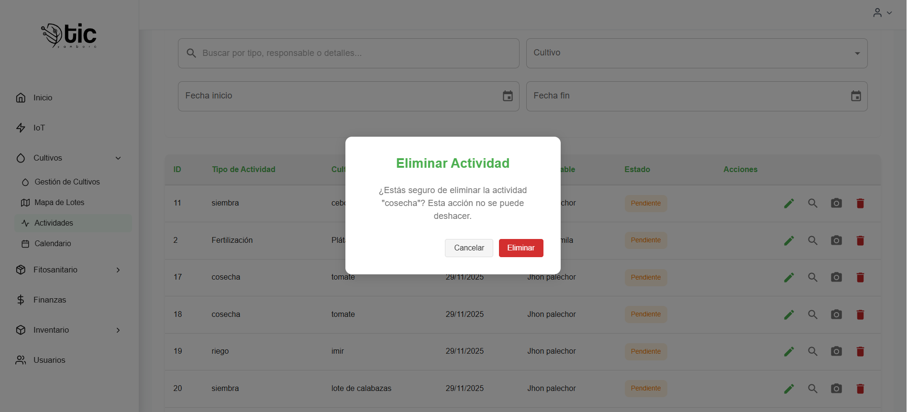
- Botones: `Eliminar` y `Cancelar`.
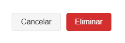

- Nota: la eliminación es irreversible.

## Paginación
- Control inferior con `Pagination`.
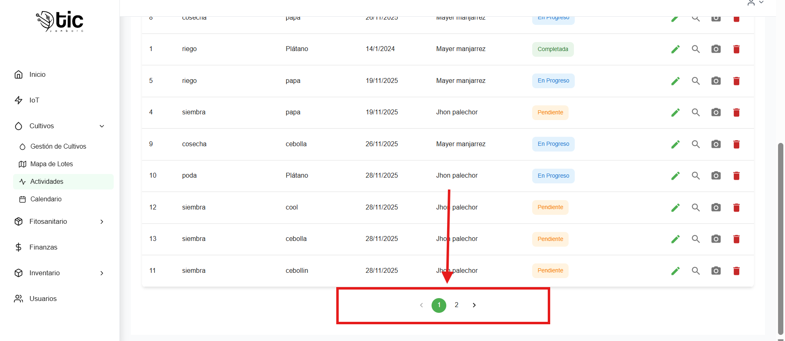

- Tamaño de página: 10 actividades por página.
- Cambiar de página actualiza la consulta sin perder filtros.

## Notificaciones
- Éxito: crear/editar/eliminar y subir foto muestran mensajes de éxito.

- Error: carga de datos, guardado o eliminación muestran mensajes descriptivos.

## Flujo típico
- Crear:
  - `Nueva Actividad` → completar campos requeridos → `Crear Actividad`.
- Editar:
  - Ícono lápiz en la fila → modificar campos → `Actualizar`.
- Ver detalles:
  - Ícono lupa en la fila → revisar información y fotos → `Cerrar`.
- Fotodocumentar:
  - Ícono cámara → seleccionar imagen y escribir descripción → `Guardar`.
- Eliminar:
  - Ícono papelera → confirmar en el modal → actividad eliminada.

## Tips y resolución de problemas
- “No tienes permisos para ver Actividades”: solicita permisos adecuados o inicia sesión con un rol autorizado.
- Filtros sin resultados: revisa el rango de fechas y el cultivo seleccionado.
- Error al guardar: verifica campos requeridos y formatos numéricos; revisa mensajes específicos del servidor.
- Foto demasiado grande: reduce el tamaño (< 5MB) o comprime la imagen.
- No aparecen insumos: intenta nuevamente; si persiste, consulta con el administrador para revisar el catálogo de insumos.
- Cambios de permisos: si tu rol o permisos cambiaron, recarga la página para refrescar permisos.

## video explicativo de app movil 

- manejo del modulo de actividades  
<iframe
  style="width: 100%; max-width: 560px; height: auto; aspect-ratio: 16/9;"
  src="https://youtube.com/embed/3SG8DyYbzRQ?si=jDK_OwRT2YQRBCN-  "
  title="YouTube vido de control actividades "
  frameborder="0"
  allow="accelerometer; autoplay; clipboard-write; encrypted-media; gyroscope; picture-in-picture; web-share"
  allowfullscreen>
</iframe>
- registro explica de actividades  
<iframe
  style="width: 100%; max-width: 560px; height: auto; aspect-ratio: 16/9;"
  src="https://youtube.com/embed/g2tDlcXiGIk?si=PsG2jsd5lwaX7Jyk "
  title="YouTube vido de  actividades "
  frameborder="0"
  allow="accelerometer; autoplay; clipboard-write; encrypted-media; gyroscope; picture-in-picture; web-share"
  allowfullscreen>
</iframe>