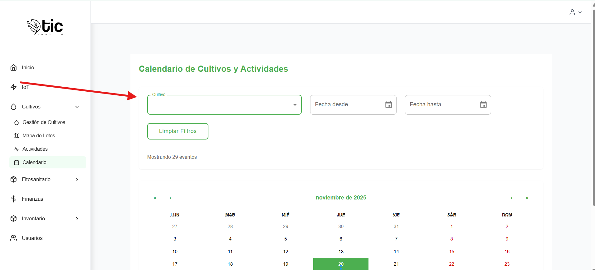
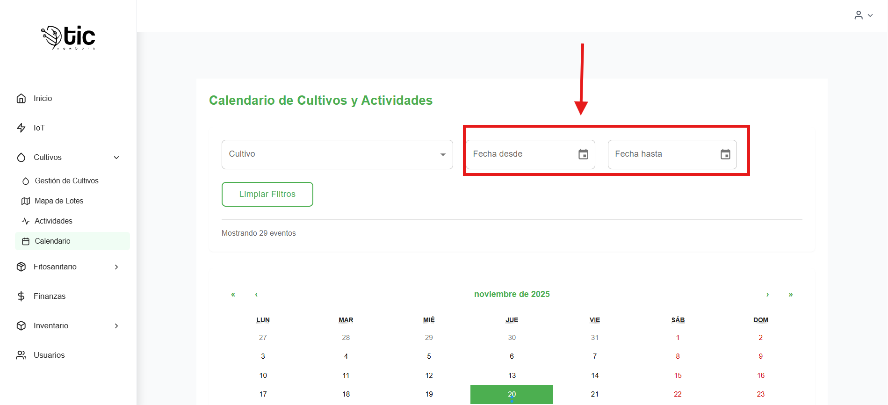
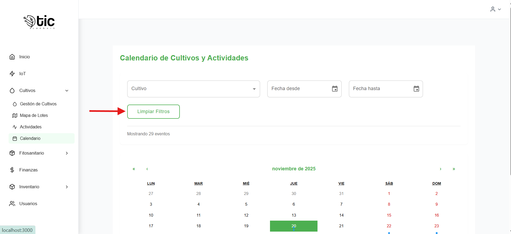
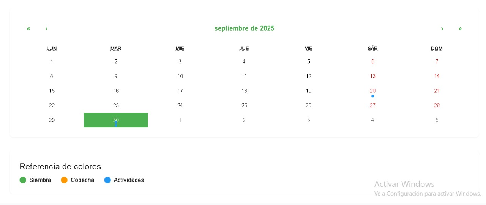
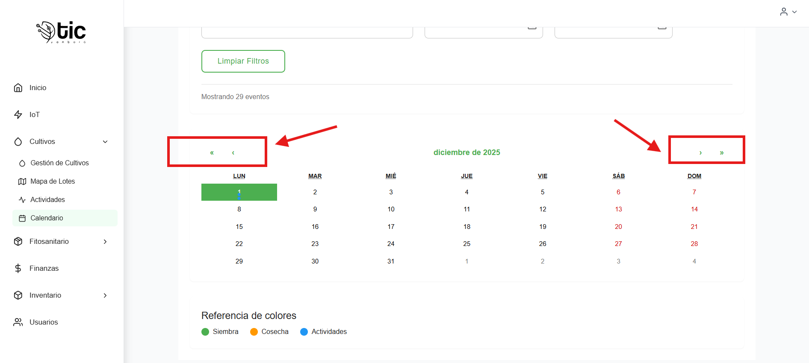
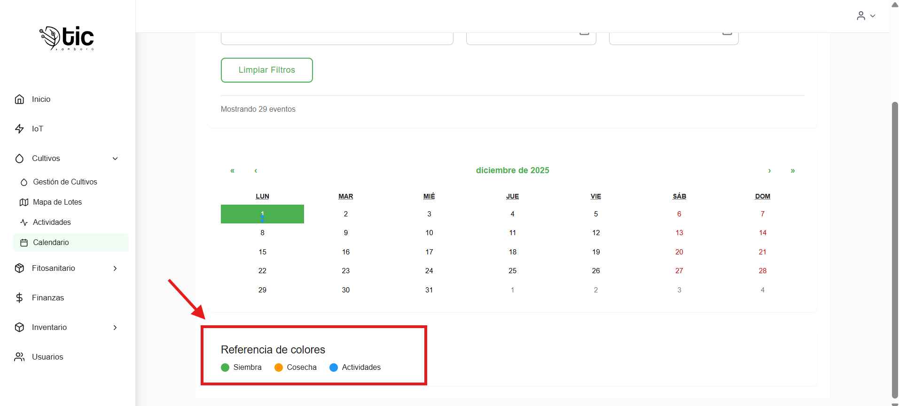
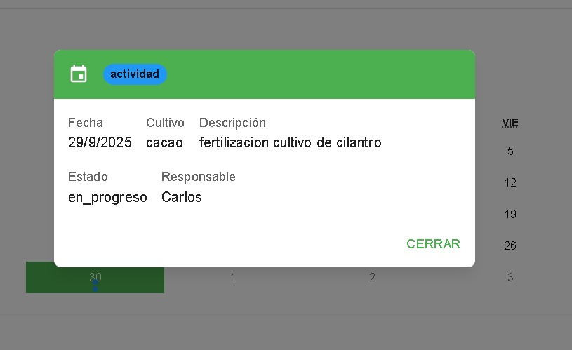

###  Módulo de Calendario

Este modulo permite al usuario visualizar las actividades pendientes de los usuarios registrados a los que seles a asignado una actividad 
## Propósito
- Visualizar eventos relacionados con cultivos y actividades en una vista de calendario mensual.
- Filtrar por cultivo y rango de fechas.
- Consultar detalles de un evento específico.

## Controles y Botones
- **Cultivo** (selector):
  - Lista todos los cultivos disponibles.
  - Opción "Todos los cultivos" para no filtrar por cultivo.
  - Al seleccionar un cultivo, se muestran únicamente eventos cuyo `id_cultivo` coincide.

- **Fecha desde** (selector de fecha):
  - Limita resultados a eventos con `fecha` mayor o igual a la seleccionada.

- **Fecha hasta** (selector de fecha):
  - Limita resultados a eventos con `fecha` menor o igual a la seleccionada.

- **Limpiar Filtros** (botón):
  - Restablece el filtro de cultivo y el rango de fechas (desde/hasta) a valores vacíos.

- **Resumen de filtros**:
  - Muestra el contador: `Mostrando N eventos` tras aplicar filtros.
## Calendario
- **Vista mensual**:
  - Cada día puede mostrar hasta 3 puntos de color que representan eventos.
  - Al hacer clic sobre un punto, se abre el detalle del evento.

- **Navegación**:
  - Usa los controles de `react-calendar` (flechas) para cambiar el mes.
  - Se personaliza el estilo (color, hover, deshabilitado) según `CalendarPage.css`.

## Leyenda de colores
- **Siembra**: verde (`#4caf50`).
- **Cosecha**: naranja (`#ff9800`).
- **Actividad**: azul (`#2196f3`).

## Detalle de Evento (Modal)
- Se abre al hacer clic en un punto de evento del calendario.
- Muestra:
  - **Icono y título** del evento (usa `titulo` o `tipo_actividad`).
  - **Chip** del tipo (`siembra`, `cosecha`, `actividad`).
  - **Fecha** (formato local `es-ES`).
  - **Cultivo** (buscado en la lista de cultivos por id, mostrando nombre/tipo más legible).
  - **Descripción**, **Estado** y **Responsable** si están disponibles.
- **Cerrar** (botón): cierra el modal.

## Carga y Filtros de Datos
- **Carga de eventos**:
  - Al abrir la pantalla, se solicita al backend el rango de 6 meses hacia atrás y 6 meses hacia adelante desde la fecha actual.
  - Endpoint utilizado por el servicio: `calendarService.getCalendarEvents(<desde>, <hasta>)`.
- **Filtrado en cliente**:
  - Por **cultivo** (`id_cultivo`).
  - Por **fecha desde/fecha hasta** (comparando `fecha`).

## Estados y Comportamiento
- **Cargando**:
  - Muestra un spinner centrado mientras se consultan eventos.

- **Errores de carga**:
  - Se notifican a través de `AlertContext` con el título "Error de Carga".

## Consejos de Uso
- Para encontrar eventos de un cultivo:
  1. Selecciona el cultivo en el filtro.
  2. Ajusta `Fecha desde` y `Fecha hasta` si necesitas acotar más el rango.
  3. Navega el calendario y haz clic en los puntos de color para ver detalles.

- Para volver a la vista general:
  - Pulsa **Limpiar Filtros** para ver todos los eventos del rango cargado.

## Resolución de Problemas
- **No se ven eventos**:
  - Ajusta `Fecha desde`/`Fecha hasta` a un rango más amplio.
  - Verifica que el backend esté retornando eventos para el rango (6 meses atrás y adelante).

- **El cultivo muestra N/A en el modal**:
  - Puede deberse a que el evento no incluye un `id_cultivo` reconocible o el cultivo no está en la lista cargada.

- **Error de carga**:
  - Comprueba conectividad y el endpoint del calendario en el backend usado por `calendarService`.

## Permisos
- El módulo presenta información (lectura). Actualmente no requiere permisos especiales para acciones de creación/edición desde esta pantalla.

## video explicativo de app movil 

- manejo del calendario de actividades
<iframe
  style="width: 100%; max-width: 560px; height: auto; aspect-ratio: 16/9;"
  src="https://youtube.com/embed/V5lxV8x-SD8?si=jitW83JHhFaQAhGy"
  title="YouTube video de actividades"
  frameborder="0"
  allow="accelerometer; autoplay; clipboard-write; encrypted-media; gyroscope; picture-in-picture; web-share"
  allowfullscreen>
</iframe>
