# Manual del Módulo de Finanzas

Este documento explica, para usuarios finales, el uso del módulo de finanzas: filtros, registro de ingresos, pestañas de análisis, exportaciones y cómo interpretar cada tabla.

## Barra de Filtros
- **Cultivo** (selector): elige el cultivo sobre el cual se consultan los datos.
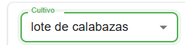

- **Desde** y **Hasta** (fechas): define el rango de tiempo para las consultas y gráficos.
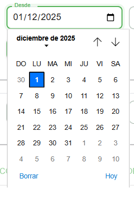

- **Grupo** (selector): agrupa las series por `Mes`, `Semana` o `Día`.
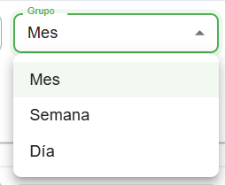
- **Tipo** (selector): filtra por `Todos`, solo `Ingresos` o solo `Egresos`.
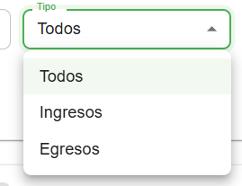
- **Criterio** (selector): elige cómo evaluar la rentabilidad (`Margen`, `B/C`, `% Margen`).
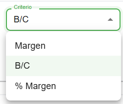
- **Umbral** (numérico): valor de corte para evaluar rentabilidad (por ejemplo, B/C > Umbral).
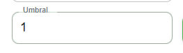

- **APLICAR** (botón): recalcula y actualiza los datos en todos los paneles según los filtros. Se habilita cuando hay un cultivo seleccionado.

## Registrar Ingreso (si tienes permiso)
- **Fecha ingreso** (fecha): fecha del movimiento de ingreso.

- **Monto** (numérico): monto del ingreso (COP).
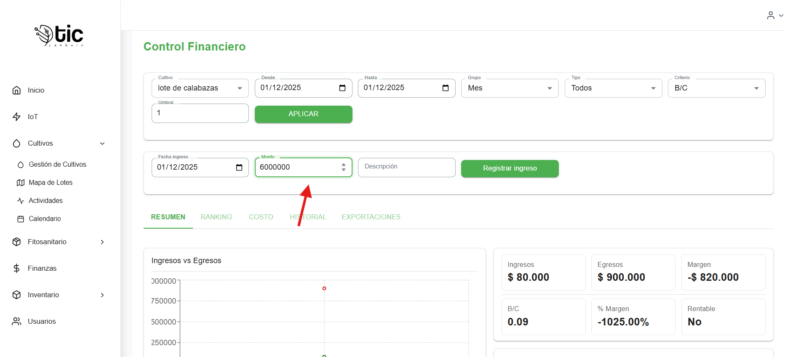
- **Descripción** (texto): detalle opcional.
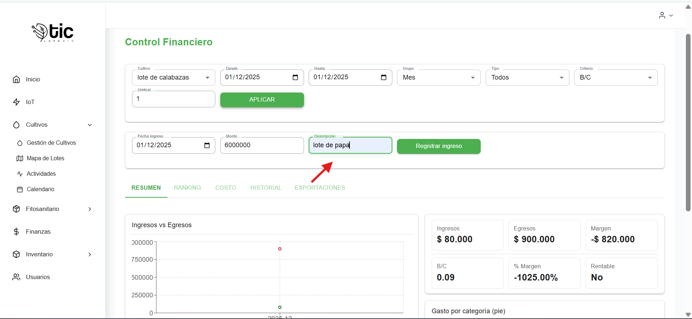
- **Registrar ingreso** (botón): crea un ingreso para el cultivo seleccionado y actualiza las vistas (resumen, ingresos, ranking).
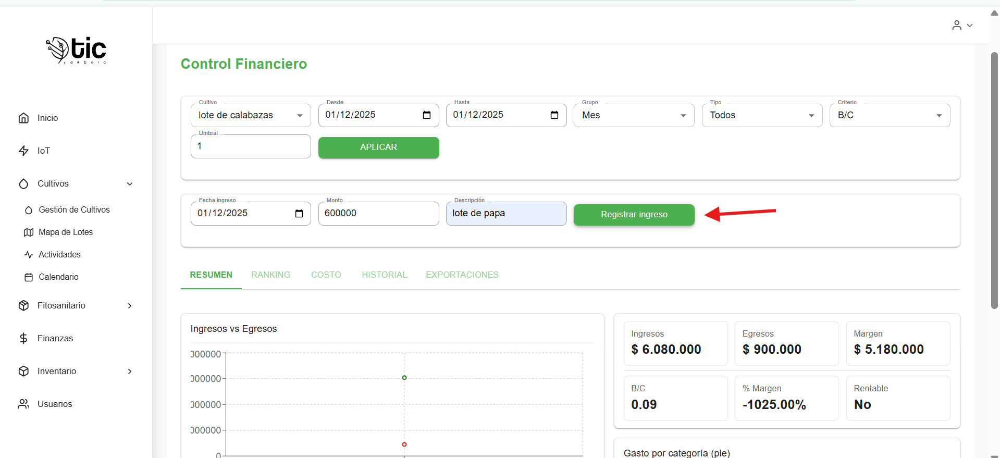

  - Requiere permisos: `ingresos:crear` o `ingresos:*`.
  - Se habilita cuando `Fecha` y `Monto` son válidos.

## Pestañas de Navegación
### Resumen
- Gráficos: **Ingresos vs Egresos** y **Margen por período**.
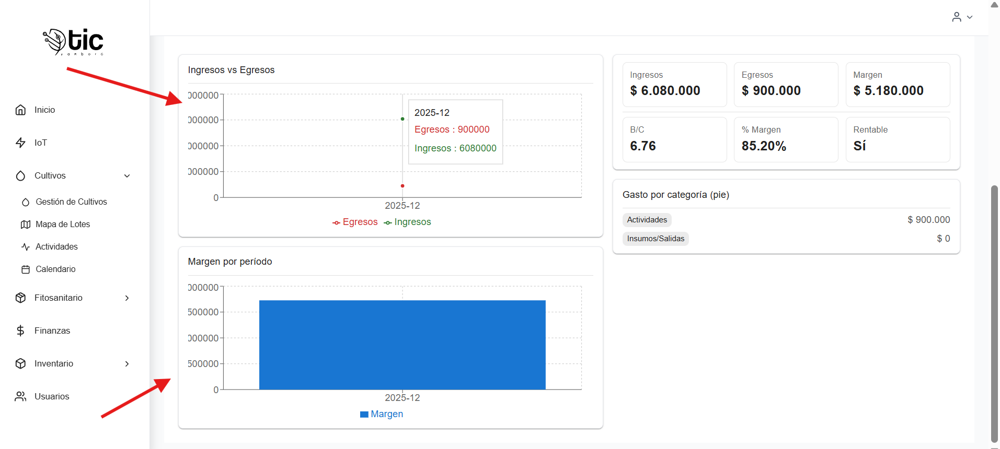
- KPIs: **Ingresos**, **Egresos**, **Margen**, **B/C**, **% Margen**, **Rentable**.
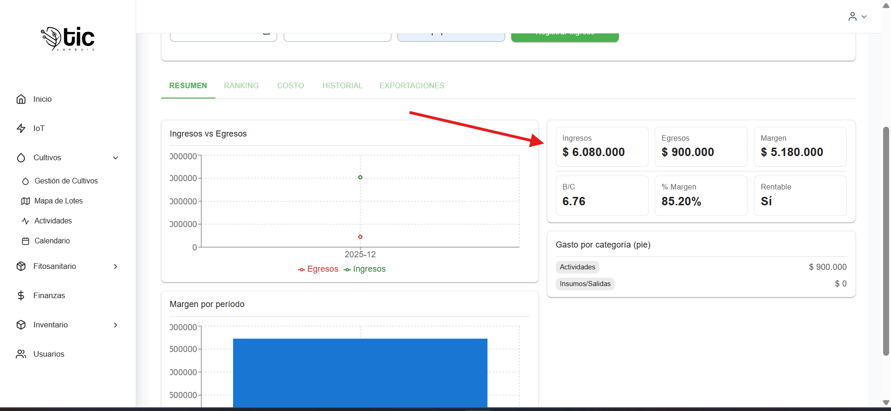
- **Gasto por categoría** mostrando las categorías más relevantes.

### Ranking
- **Ranking por cultivo** (barras) y **Gastos por cultivo**.
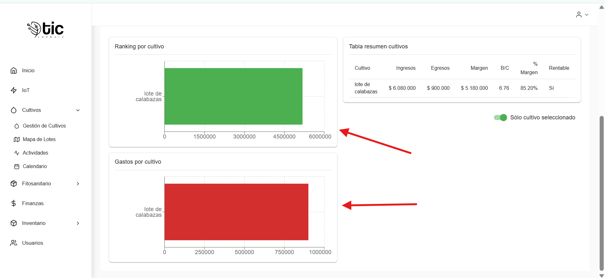

- **Tabla resumen** por cultivo: Ingresos, Egresos, Margen, B/C, % Margen, Rentable.

- **Sólo cultivo seleccionado** (switch): limita el ranking y la tabla al cultivo elegido en filtros.
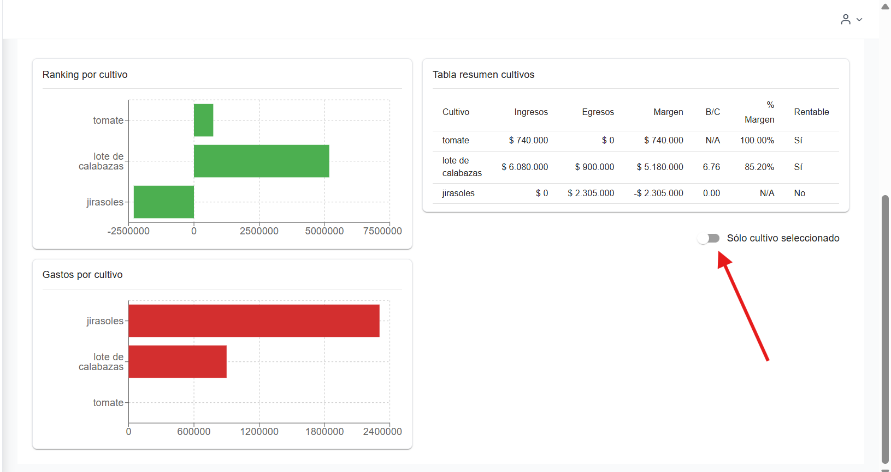

### Costo
- KPIs de costo: Egresos, Mano de obra (registrada), Maquinaria (registrada), Costo de producción.

- **Parámetros** ajustables (persisten por cultivo en el navegador):
  - Costo hora
  - Depreciación mensual
  - Vida útil herramientas (meses)
  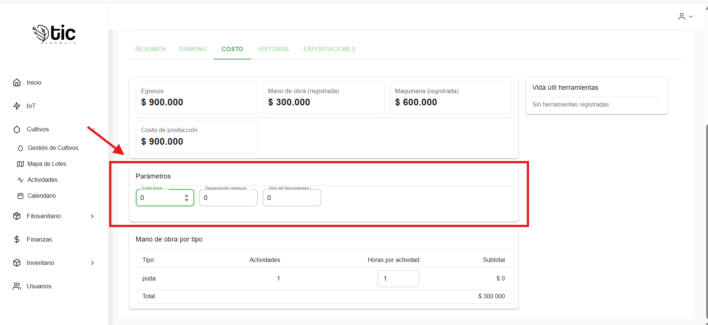
- Tablas:
  - **Mano de obra por tipo** (permite editar "Horas por actividad" por tipo).
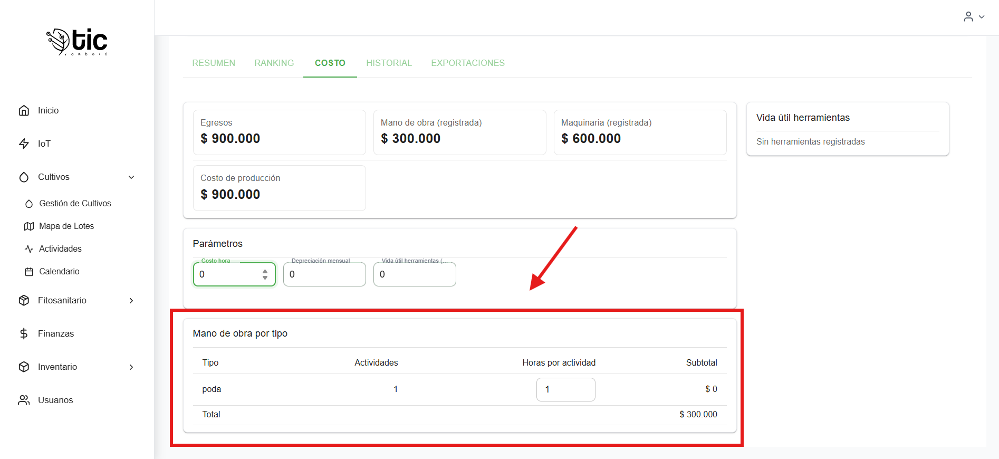
  - **Vida útil herramientas** (edad y meses restantes).
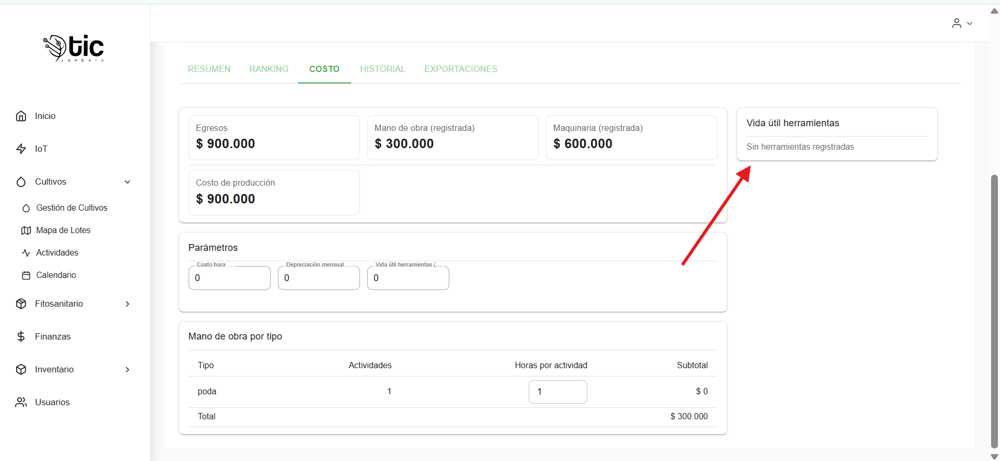

### Historial
- **Historial de actividades**: fecha, tipo, responsable y detalles.
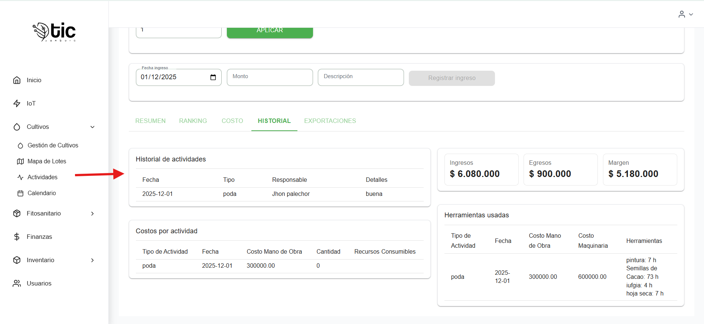
- **Costos por actividad**: consumibles usados y cantidades.

- **Herramientas usadas**: horas de uso y costo maquinaria.
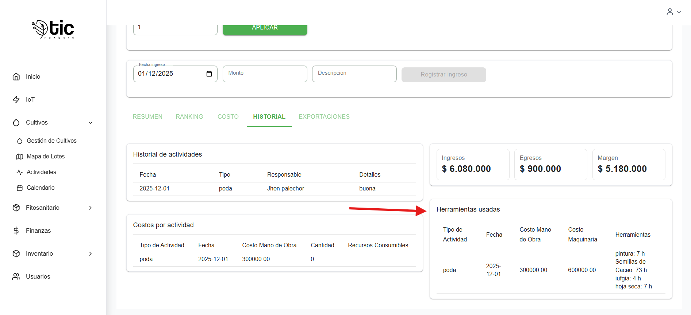

### Exportaciones
- **Exportar Excel** (botón): descarga un Excel con encabezado, KPIs y tabla de Periodo/Ingresos/Egresos/Margen.

- **Exportar PDF** (botón): abre una vista imprimible con los mismos KPIs y tabla (puedes imprimir o guardar como PDF).

- **Vista previa**: muestra las primeras filas que se exportarán.

- Si no tienes permisos de exportación, los botones aparecen deshabilitados y se muestra el mensaje: "No tienes permiso para exportar datos financieros".

## Permisos
- **Exportación**: requiere `finanzas:exportar` o `finanzas:*`.
- **Registrar ingreso**: requiere `ingresos:crear` o `ingresos:*`.
- **APLICAR**: disponible para todos los usuarios, se habilita con cultivo seleccionado.

## Comportamiento y Estado
- **Selección automática**: si hay cultivos disponibles, se selecciona automáticamente el primero al entrar.
- **Persistencia local**: parámetros de costo (costo hora, depreciación mensual, vida útil, horas por tipo) se guardan por cultivo en el almacenamiento local del navegador.
- **Agrupación**: el selector `Grupo` controla la agrupación en gráficos y exportaciones.

## Consejos de Uso
- Flujo de análisis:
  1. Selecciona **Cultivo**, ajusta **Desde/Hasta**, define **Grupo** y pulsa **APLICAR**.
  2. Cambia **Criterio** y **Umbral** para evaluar la rentabilidad en **Ranking**.
  3. Ajusta parámetros en **Costo** para refinar mano de obra y depreciación.
  4. Usa **Exportaciones** para Excel/PDF al compartir o archivar.
- Flujo para **Registrar ingreso**:
  1. Selecciona **Cultivo**.
  2. Completa **Fecha**, **Monto** y **Descripción**.
  3. Pulsa **Registrar ingreso** y verifica que los KPIs y tablas se actualizan.

## Resolución de Problemas
- **Botones deshabilitados**:
  - APLICAR: selecciona un cultivo.
  - Exportar Excel/PDF: confirma permisos (`finanzas:exportar` o `finanzas:*`) y cultivo seleccionado.
  - Registrar ingreso: confirma permisos (`ingresos:crear` o `ingresos:*`) y valida Fecha/Monto.
- **Datos vacíos**:
  - Ajusta `Desde/Hasta` y `Grupo`.
  - Verifica que el backend expone los endpoints de finanzas y actividades.
- **Rentabilidad N/A**:
  - Revisa que existan datos de ingresos/egresos en el rango y cultivo.

## video explicativo  de app movil 

- manejo del modulo de finanzas 
<iframe
  style="width: 100%; max-width: 560px; height: auto; aspect-ratio: 16/9;"
  src="https://youtube.com/embed/cPJAYbaetpM?si=7dJi1BksRTAPgy1a"
  title="YouTube vido de control financiero "
  frameborder="0"
  allow="accelerometer; autoplay; clipboard-write; encrypted-media; gyroscope; picture-in-picture; web-share"
  allowfullscreen>
</iframe>
- manejo de la mano de obra en  finanzas 

<iframe
  style="width: 100%; max-width: 560px; height: auto; aspect-ratio: 16/9;"
  src="https://youtube.com/embed/flsQDbhblAk?si=5bv59oBGfbUZM-H0"
  title="YouTube video mano de obra"
  frameborder="0"
  allow="accelerometer; autoplay; clipboard-write; encrypted-media; gyroscope; picture-in-picture; web-share"
  allowfullscreen>
</iframe>
