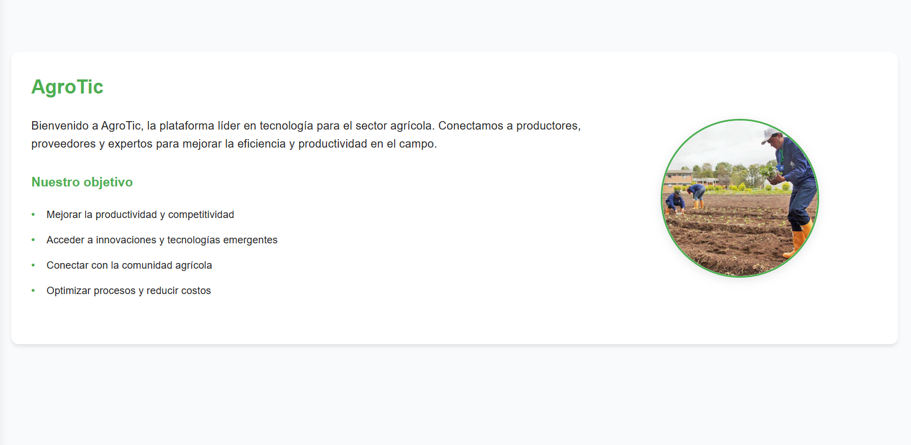
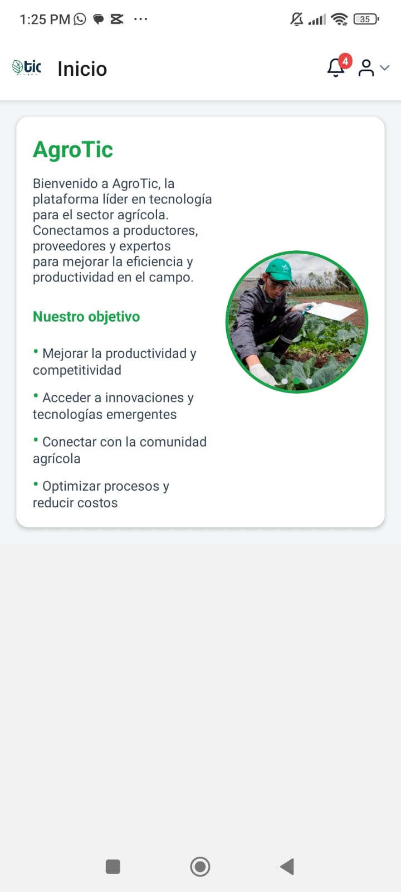

### ¿Que es AgroTIC?

AgroTIC es un aplicativo web y móvil para la gestión integral de la producción agrícola. Centraliza la información de cultivos, actividades, finanzas, inventario y monitoreo para facilitar el trabajo de campo y la toma de decisiones en administración.
###  Credenciales de Acceso
-  **Usuario:** 666666
-  **Contraseña:** Admin12345
### Vista general de la aplicacion

## Objetivo
- Mejorar la trazabilidad, la eficiencia operativa y el control de costos en cada etapa del ciclo productivo.

## Modulos Principales
- Actividades: planificación, ejecución, estados y fotodocumentación.
- Calendario: visualización de tareas y eventos por cultivo y fecha.
- Finanzas: ingresos/egresos, KPIs y reportes exportables.
- Inventario: control de insumos, herramientas y consumos por actividad.
- Cultivos y lotes: organización por áreas y seguimiento por unidad productiva.
- Sensores/IoT: integración de datos ambientales (cuando aplica).
- Seguridad y permisos: acceso por roles y permisos granulares.

## Beneficios
- Visibilidad en tiempo real del avance y los costos.
- Decisiones informadas mediante indicadores y reportes.
- Orden y trazabilidad de actividades y recursos.

## Acceso
- Disponible en web (frontend React) y móvil (Expo).
- Autenticación y permisos según rol: administrador, instructor, aprendiz/pasante.
