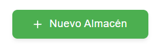
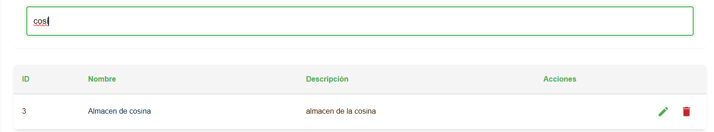
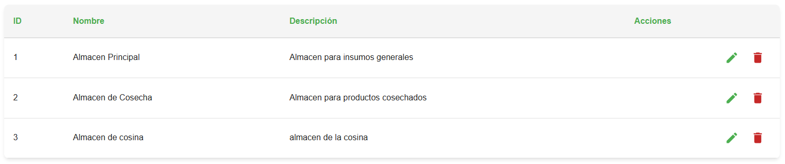
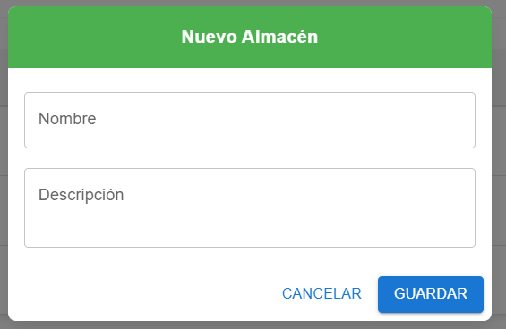
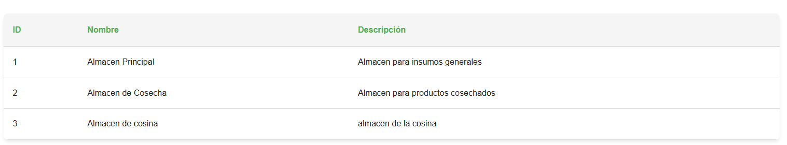

## Gestión de Almacenes 

Esta pantalla permite crear, buscar, editar y eliminar almacenes para organizar los insumos.

### Encabezado y botones
- `Nuevo Almacén`: abre el formulario para crear un almacén.

- `Buscar`: filtra por nombre o descripción.

### Tabla de almacenes
- Columnas:
  - `ID`: identificador del almacén.
  - `Nombre`: nombre del almacén.
  - `Descripción`: detalle u observación del almacén.
  - `Acciones`: editar o eliminar (según permisos).

### Acciones por fila
- `Editar`: abre el formulario con datos del almacén.
- `Eliminar`: muestra confirmación antes de borrar.

### Formulario de Almacén
- Campos: `Nombre`, `Descripción`.
- Botones: `Guardar`, `Cancelar`.

### Permisos
- Crear/Editar/Eliminar disponible para roles 
`administrador` e `instructor`.

`aprendiz` e `pasante`.

## video explicativo de app movil 

- manejo del modulo de almacenes 
<iframe
  style="width: 100%; max-width: 560px; height: auto; aspect-ratio: 16/9;"
  src="https://youtube.com/embed/DD-1Z0Q-wBI?si=JHMf6LsikSXvW-6K"
  title="YouTube vido de control financiero "
  frameborder="0"
  allow="accelerometer; autoplay; clipboard-write; encrypted-media; gyroscope; picture-in-picture; web-share"
  allowfullscreen>
</iframe>