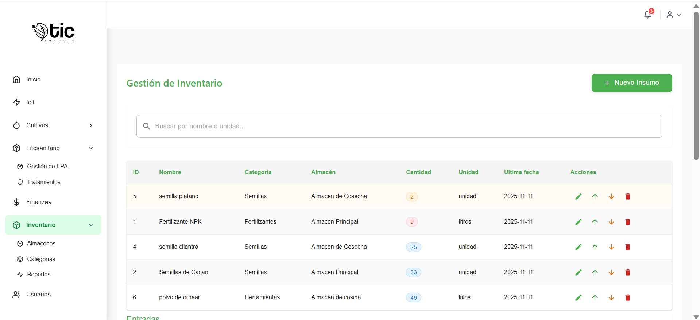
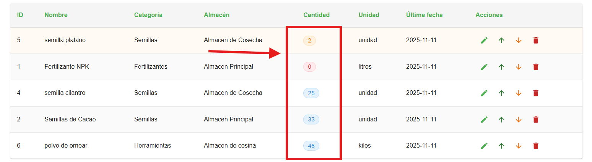
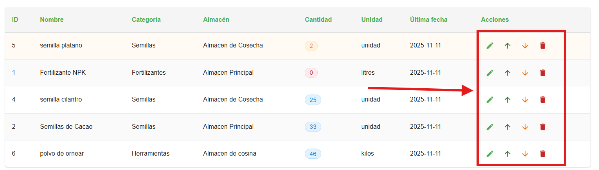
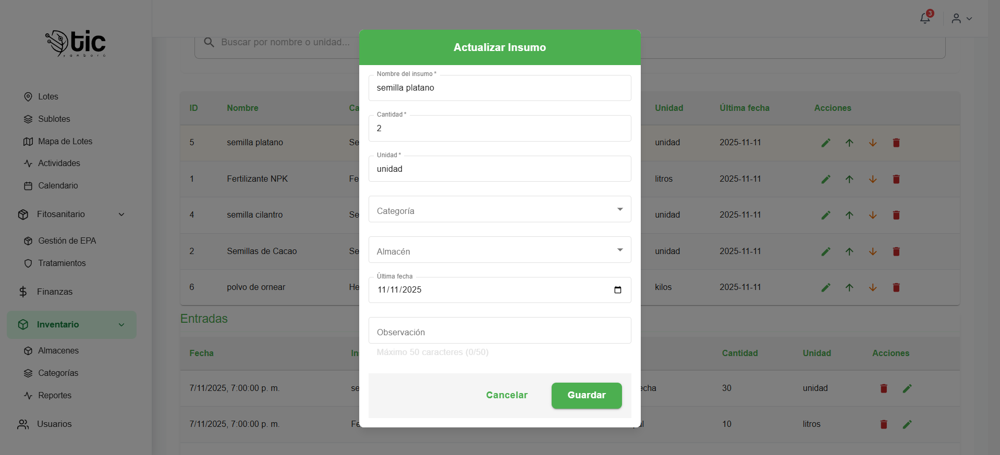
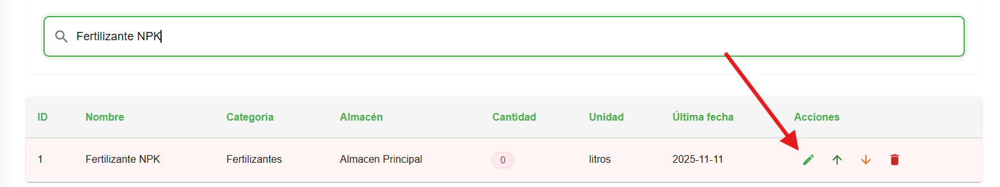

### Gestión de Inventario 

Esta sección te ayuda a manejar insumos y existencias de forma sencilla. Está pensada para usuarios: prioriza lo visible en la pantalla, los botones y la tabla.

### Encabezado y botones principales
- `Nuevo Insumo`: abre un formulario para crear un insumo nuevo.

- `Buscar`: campo de texto para filtrar la tabla por nombre, categoría, almacén o código.

### Tabla de inventario
- Columnas visibles:
  - `ID`: identificador interno del insumo.
  - `Nombre`: nombre del insumo (fertilizante, herramienta, etc.).
  - `Categoría`: grupo al que pertenece (ej. fertilizantes, herramientas).
  - `Almacén`: ubicación física o contenedor del insumo.
  - `Cantidad`: existencias actuales. Se muestra con un “badge” de color.
  - `Unidad`: unidad de medida (ej. kg, l, und).
  - `Última Fecha`: última actualización o movimiento registrado.
  - `Acciones`: botones rápidos para operar sobre el insumo.

### Colores de stock (badge de Cantidad)
- `Rojo` (crítico): cantidad ≤ 1. Atiende este insumo cuanto antes.
- `Amarillo` (bajo): cantidad ≤ 5. Vigila y planifica reposición.
- `Verde` (ok): cantidad mayor a 5. Stock suficiente.

### Acciones por fila (botones)
- `Editar inventario`: abre el formulario para actualizar datos del insumo.
- `Entrada rápida`: registra una entrada (aumenta la cantidad).
- `Salida rápida`: registra una salida (disminuye la cantidad).
- `Eliminar inventario`: solicita confirmación y elimina el registro del inventario.

### Formularios y diálogos
- `Nuevo/Editar Insumo`:
  - Campos frecuentes: `Nombre`, `Unidad`, `Código`, `Fecha`, `Observación`, `Categoría`, `Almacén`, `Última fecha`.
  - Uso: completa los campos y guarda para crear o actualizar.
- `Entrada/Salida rápida`:
  - Campos frecuentes: `Insumo`, `Tipo de movimiento` (entrada/salida), `Cantidad`, `Unidad`, `Fecha`, `Observación`.
  - Uso: indica cantidad y guarda para registrar el movimiento.
- `Confirmar eliminación`:
  - Muestra el nombre del insumo y pide confirmar. No afecta el insumo base en otras secciones.

### Pasos rápidos
- Buscar un insumo y editar:
  - Escribe en `Buscar` → en la fila, pulsa `Editar inventario` → ajusta los datos → `Guardar`.
  
- Registrar una entrada de stock:
  - En la fila, pulsa `Entrada rápida` → escribe la cantidad → `Guardar`.
  
- Registrar una salida de stock:
  - En la fila, pulsa `Salida rápida` → escribe la cantidad → `Guardar`.
  
- Eliminar un registro:
  - Pulsa `Eliminar inventario` → revisa el mensaje → `Confirmar`.

## video explicativo de app movil 

- manejo del modulo de inventario  
<iframe
  style="width: 100%; max-width: 560px; height: auto; aspect-ratio: 16/9;"
  src="https://www.youtube.com/embed/v7T_GxJ8Iu4?si=Barv9lioZZefdkz5"
  title="YouTube video de control inventario"
  frameborder="0"
  allow="accelerometer; autoplay; clipboard-write; encrypted-media; gyroscope; picture-in-picture; web-share"
  allowfullscreen>
</iframe>