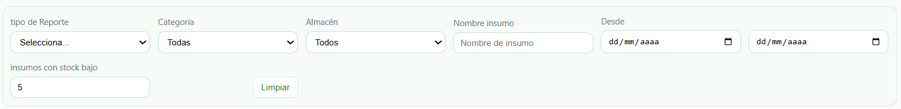
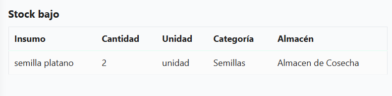
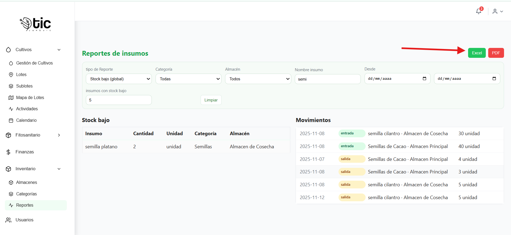

## Reportes de Insumos 
Analiza y exporta información del inventario: stock bajo y movimientos.

### Encabezado y exportación
- Título: `Reportes de insumos`.
- Botones: `Excel`, `PDF` para descargar reportes.

### Filtros visibles
- `tipo de Reporte` (presets): `Todo inventario y movimientos`, `Stock bajo (global)`, `Hoy`, `Últimos 7 días`.
- `Categoría`: filtra por categoría seleccionada.
- `Almacén`: filtra por almacén seleccionado.
- `Buscar`: filtra por nombre de insumo.
- `Rango de fechas`: `Desde` y `Hasta` para movimientos.
- `Umbral stock bajo`: define la cantidad para considerar “bajo stock”.
- `Restablecer`: limpia filtros y vuelve al estado inicial.

### Sección: Stock bajo
- Tabla con columnas: `Insumo`, `Cantidad`, `Unidad`, `Categoría`, `Almacén`.
- Muestra insumos con cantidad ≤ umbral configurado.

### Sección: Movimientos
- Lista o tabla con: `Fecha`, `Tipo` (Entrada/Salida), `Insumo`, `Almacén`, `Cantidad`, `Unidad`.
- Filtrada por categoría, almacén, búsqueda y rango de fechas.

### Exportación
- `Excel`: genera archivo `.xlsx` con stock bajo (incluye auto-filtro y anchos de columna).

- `PDF`: imprime/descarga resumen, tabla de stock bajo y movimientos recientes.

### Mensajes útiles
- Carga: “Cargando…”.
- Error: “No se pudieron cargar los reportes de inventario”.
- Vacíos: “Sin registros de stock bajo”, “Sin movimientos recientes”.

## video explicativo de app movil 

- manejo del modulo de reportes  
<iframe
  style="width: 100%; max-width: 560px; height: auto; aspect-ratio: 16/9;"
  src="https://youtube.com/embed/qA-EXjiapD0?si=BOrnL8MfVsIAoPLe"
  title="YouTube vido de control reportes "
  frameborder="0"
  allow="accelerometer; autoplay; clipboard-write; encrypted-media; gyroscope; picture-in-picture; web-share"
  allowfullscreen>
</iframe>