# Módulo: Gestión de Usuarios (Web)

## ¿Qué es y para qué sirve?
- Administra las cuentas de usuarios del sistema: creación, edición, eliminación y permisos.
- Facilita la búsqueda y revisión de datos básicos: nombres, correo, tipo y número de documento, rol.
- Permite asignar o revocar permisos específicos a cada usuario desde un modal dedicado.

## Acceso y requisitos
- Requiere rol Administrador o permisos adecuados.
- Permisos típicos para operar el módulo:
  - `usuarios:ver` para visualizar la tabla.
  - `usuarios:crear` para crear usuarios.
  - `usuarios:editar` para editar usuarios.
  - `usuarios:eliminar` para eliminar usuarios.
  - Para gestionar permisos en el modal: rol Admin (backend) y, opcionalmente en UI, `permisos:asignar` y `permisos:revocar`.
- Si no tienes permisos, verás un mensaje indicando que no puedes acceder al módulo.

## Elementos principales de la pantalla
- Título: “Gestión de Usuarios”.
- Barra de búsqueda:
  - Caja de texto para buscar por nombre, email o documento.
  - El filtro aplica en tiempo real sobre el listado.
  
- Botón “Nuevo Usuario”:
  - Visible solo si tienes permisos de creación.
  - Abre el formulario de alta.
  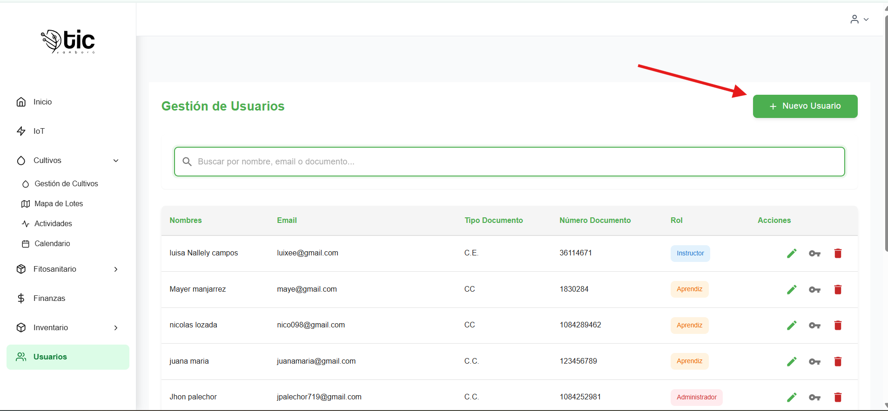
- Tabla de usuarios:
  - Columnas: Nombres, Email, Tipo Documento, Número Documento, Rol.
  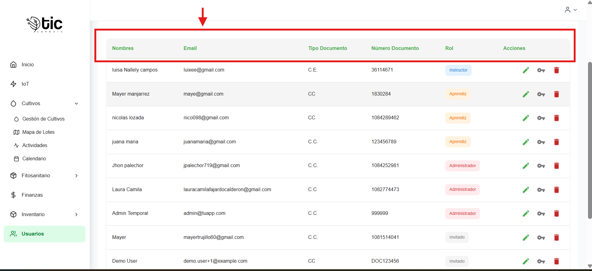

  - Columna “Acciones” (si tienes permisos) con botones:
    - Editar
    - Permisos
    - Eliminar
  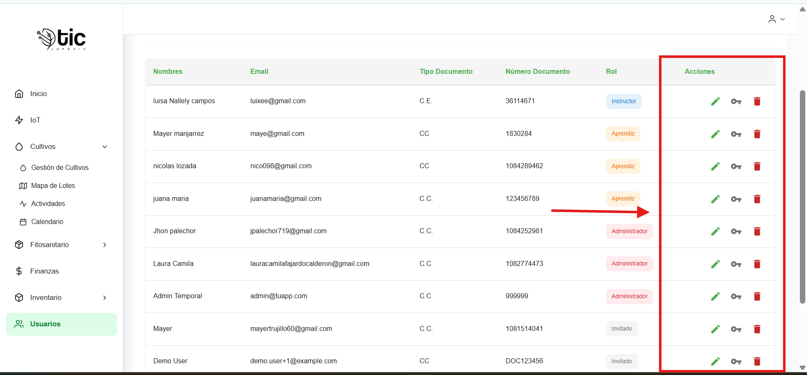
  
- Paginación:
  - Navega entre páginas cuando hay muchos usuarios.
  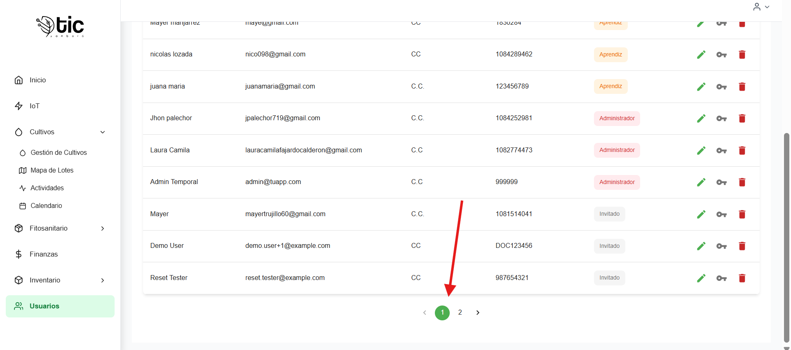

## Crear un usuario
1. Haz clic en “Nuevo Usuario”.
  

2. Completa el formulario:
   - Nombres completos
   - Email
   - Tipo de documento (CC, CE, TI, PAS)
   - Número de documento
   - Rol
   - Contraseña (requerida en creación; mínimo 6 caracteres)
   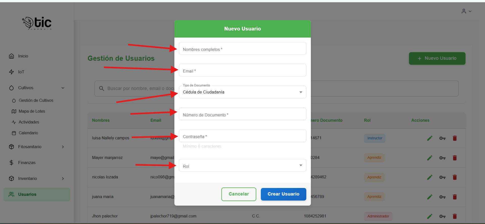
3. Presiona “Crear Usuario”.
   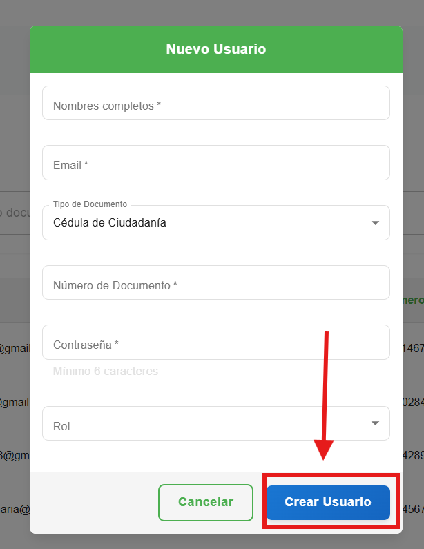

4. Si todo está correcto:
   - Se cierra el modal y verás un aviso de éxito.
   - La tabla se actualiza automáticamente.
   
5. Si hay errores:
   - Se muestran mensajes específicos en cada campo (por ejemplo, email inválido, documento no numérico).

## Editar un usuario
1. En la fila del usuario, clic en “Editar”.
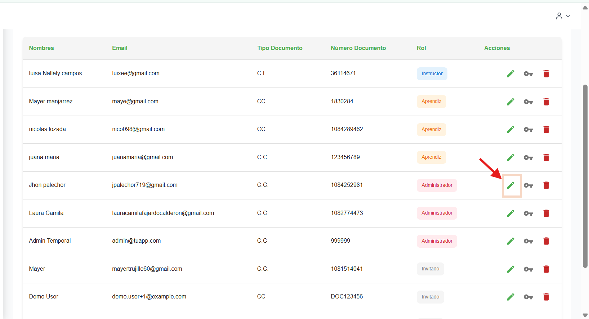
2. Ajusta los datos necesarios (Nombres, Email, Tipo/Número de documento, Rol).
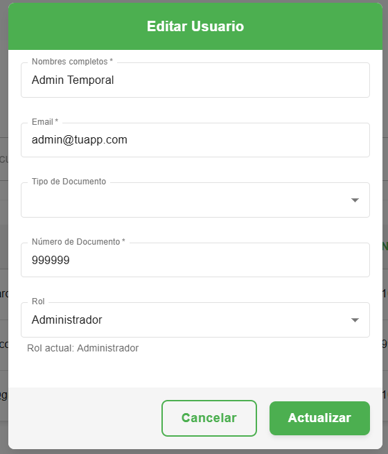
3. Presiona “Actualizar”.
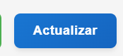
4. La lista se refresca y verás un aviso de éxito.

## Eliminar un usuario
1. En la fila del usuario, clic en “Eliminar”.
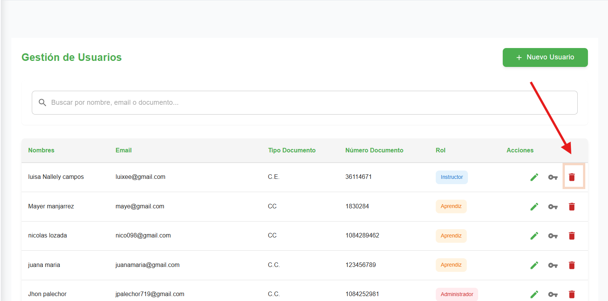
2. Confirma la operación en el modal de confirmación.
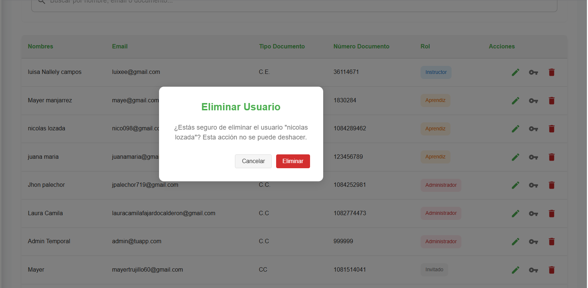
3. Si es exitosa:
   - Verás un aviso de éxito y el usuario ya no estará en la lista.
   
4. Si falla:
   - Se muestra un mensaje de error y no se realizan cambios.

## Gestionar permisos del usuario
1. En la fila del usuario, clic en el botón “Permisos”.
2. Se abre el modal de permisos:
   - Cabecera con etiquetas del usuario e ID.
   - Controles de selección:
     - Recurso (por ejemplo: `actividades`, `inventario`, `usuarios`, etc.).
    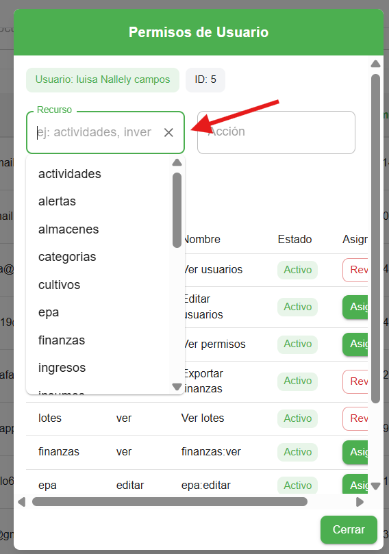
     - Acción (por ejemplo: `ver`, `crear`, `editar`, `eliminar`, `exportar`).
     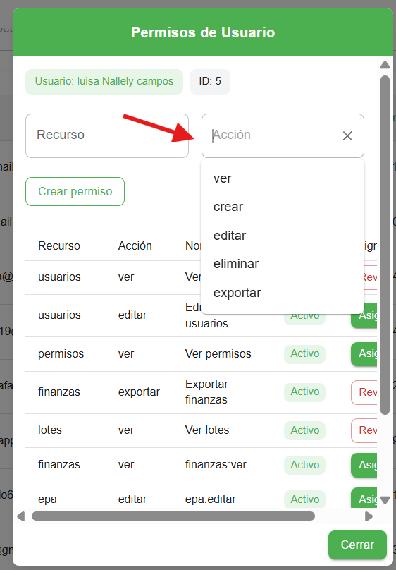
   - Botones:
     - “Crear permiso” si el permiso aún no existe en el sistema.
     
     - “Asignar” si existe y el usuario no lo tiene.
     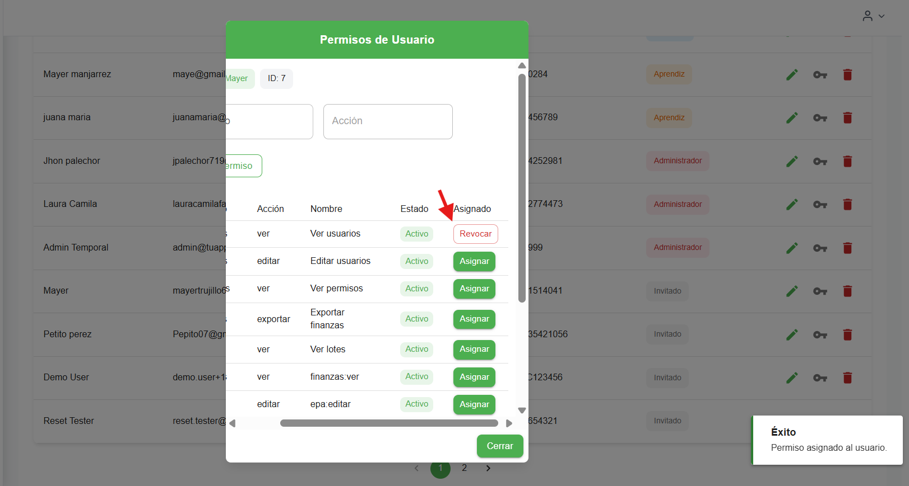
     - “Revocar” si existe y el usuario lo tiene asignado.
     
   - Tabla de permisos:
     - Muestra cada permiso con su estado (Activo/Inactivo).
     - Para cada permiso:
       - Botón “Asignar” si el usuario no lo tiene.
       - Botón “Revocar” si el usuario lo tiene.
    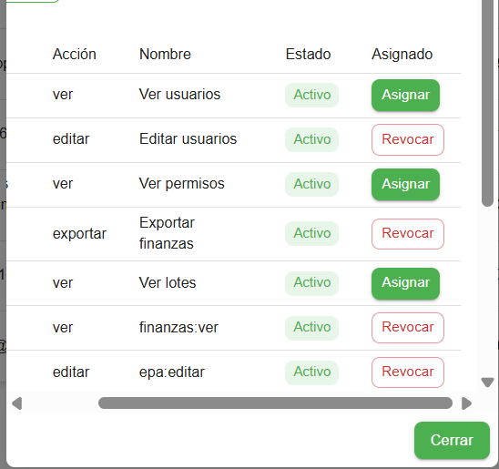

## Búsqueda y filtrado
- Escribe en la barra de búsqueda para filtrar por:
  - Nombres
  - Email
  - Número de documento
- El filtrado es sensible a mayúsculas/minúsculas y aplica de forma inmediata.

## Roles y visualización
- El rol se muestra como una etiqueta (chip) con color de fondo específico:
  - Instructor, Aprendiz, Pasante, Administrador, Invitado.

## Mensajes y estados
- Carga:
  - Muestra un indicador de progreso mientras se obtiene la lista de usuarios.
- Error de carga:
  - Muestra un mensaje de error si no fue posible cargar los usuarios.
- Vacío:
  - “No hay usuarios registrados” si la lista está vacía.
  - “No se encontraron usuarios que coincidan con la búsqueda” si el filtro no devuelve resultados.

## Consejos de uso
- Si el botón “Nuevo Usuario” no aparece:
  - Pide que te asignen `usuarios:crear` o rol Administrador.
- Si no puedes editar/eliminar:
  - Revisa que tengas `usuarios:editar` o `usuarios:eliminar`.
- Si el modal de permisos no te permite crear/asignar/revocar:
  - Verifica que tengas rol Administrador (las rutas de permisos en backend están restringidas a Admin).

## Errores comunes y soluciones
- “No tienes permisos para acceder a este módulo”:
  - Solicita que te asignen `usuarios:ver` o rol Administrador.
- Fallo al crear usuario por email:
  - Verifica que el email esté bien escrito y que no esté ya en uso.
- Documento inválido:
  - Ingresa solo números en el campo “Número de Documento”.
- Contraseña demasiado corta:
  - Debe tener al menos 6 caracteres.
## video explicativo de app movil 

- cambio de permisos y rol (solo administradores )
<iframe
  style="width: 100%; max-width: 560px; height: auto; aspect-ratio: 16/9;"
  src="https://youtube.com/embed/gZdGDp2Mdrg?si=XEFFKpOekk82t-52"
  title="YouTube video roles"
  frameborder="0"
  allow="accelerometer; autoplay; clipboard-write; encrypted-media; gyroscope; picture-in-picture; web-share"
  allowfullscreen>
</iframe>