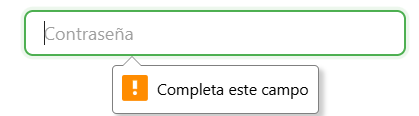
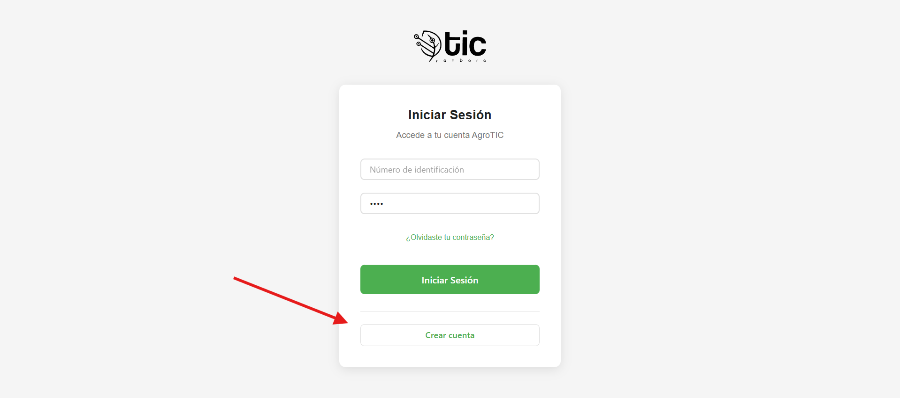
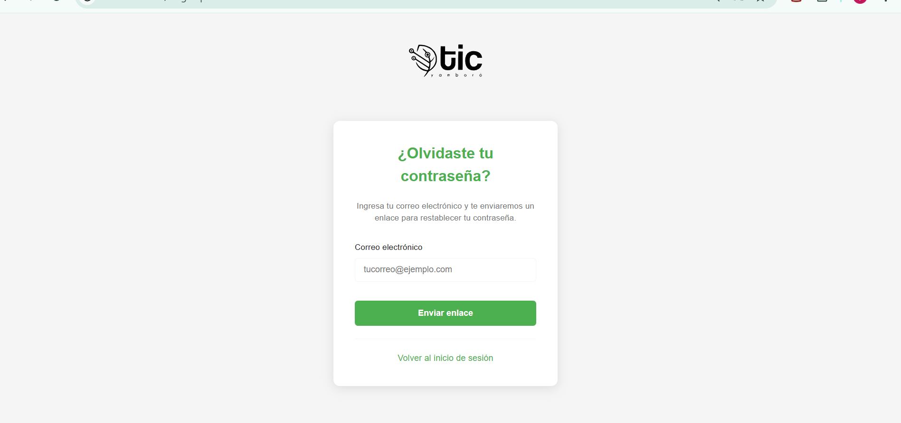
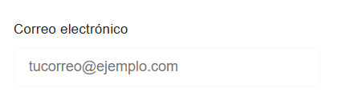
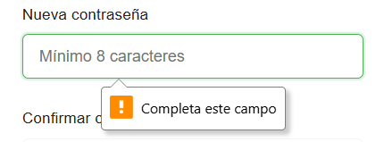
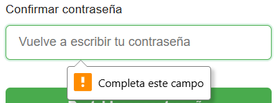
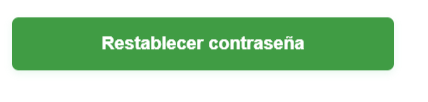

###  Login de AgroTic
Control del sistema con una seguridad implementada para el manejo de usuarios en la plataforma 
## Propósito

- Permitir el acceso seguro al sistema mediante credenciales.
- Recuperar acceso cuando el usuario olvida su contraseña.
- Restablecer la contraseña mediante un enlace enviado al correo.

## Acceso al Login
- Ruta: página de inicio de sesión `LoginPage`.
- Vista: logo AgroTIC + formulario de acceso.

## Formulario de Inicio de Sesión (`LoginForm`)
- Campos:
  - `Número de identificación` (`numero_documento`): requerido.

  - `Contraseña` (`password`): requerida.

- Botones:
  - `Iniciar Sesión`: valida y envía las credenciales.

  - `¿Olvidaste tu contraseña?`: enlace para solicitar restablecimiento.

  - `Crear cuenta`: enlace para registro de usuario.

- Validaciones y mensajes:
  - Si faltan campos: se muestran mensajes de error bajo cada campo.
  - Si el servidor no está disponible o hay error de conexión: “Error de conexión. Intenta nuevamente.”
  - Si las credenciales son inválidas: “Error de Inicio de Sesión” con detalle retornado por el servidor.

## Recuperar contraseña (`ForgotPassword`)
- Cómo acceder: pulsa “¿Olvidaste tu contraseña?” en el login.

- Campo requerido: `Correo electrónico`.

- Acción: botón `Enviar enlace`.

- Resultado esperado:
  - Si el correo es válido y existe: se envía un enlace de restablecimiento. Serás redirigido al login con aviso “Hemos enviado un enlace a tu correo para restablecer tu contraseña”.
  - Si hay error: se muestra mensaje en pantalla y notificación de error.

## Restablecer contraseña (`ResetPassword`)
- Acceso: desde el enlace recibido por correo (incluye `token` en la URL).
- Validación de enlace:
  - Si el enlace no tiene token o está inválido/expirado: se redirige al login con el mensaje “Enlace inválido o expirado. Por favor solicita un nuevo enlace.”
- Formulario:
  - `Nueva contraseña`: mínimo 8 caracteres.

  - `Confirmar contraseña`: debe coincidir con la anterior.
  
  - Botón `Restablecer contraseña`.
  
- Mensajes y estados:
  - Si no coinciden las contraseñas: “Las contraseñas no coinciden”.
  - Si es muy corta: “La contraseña debe tener al menos 8 caracteres”.
  - Si todo sale bien: se redirige al login con aviso “Tu contraseña ha sido restablecida exitosamente”.
  - Si ocurre un error: se muestra mensaje en pantalla.

## Sesión y seguridad
- Autenticación exitosa:
  - Se guarda el `token` y el `usuario` en cookies por 7 días (con seguridad `sameSite=lax` y `secure` en producción).
  - Se cargan tus permisos automáticamente.
- Desconexión automática por seguridad:
  - Si el servidor responde 401 (no autorizado), el sistema cierra la sesión y te envía al login.
- Logout manual: desde opciones del usuario (cuando estén disponibles en la interfaz) se elimina el token y se cierra sesión.

## Roles y permisos (resumen informativo)
- Roles comunes: Administrador, Instructor, Aprendiz, Pasante, Invitado.
- Tras iniciar sesión, tus permisos determinan qué módulos y acciones puedes ver/ejecutar.

## Problemas frecuentes y solución
- No puedo iniciar sesión:
  - Verifica tu número de identificación y contraseña.
  - Revisa que la API esté disponible (por defecto `http://localhost:3001`).
  - Si olvidaste la contraseña, usa “¿Olvidaste tu contraseña?”.
- Enlace de restablecimiento no funciona:
  - Solicita un nuevo enlace desde la página de “¿Olvidaste tu contraseña?”.
  - Abre el enlace completo desde tu correo, sin modificar la URL.
- Error de conexión:
  - Revisa tu conexión a internet.
  - Asegúrate que el backend esté funcionando.

## videos explicativo de app movil 
- entrar con credenciales de administrador
<iframe
  style="width: 100%; max-width: 560px; height: auto; aspect-ratio: 16/9;"
  src="https://www.youtube.com/embed/PmHZ5ctoAC4?si=aEQYi-v294iJ8MlI"
  title="YouTube video player"
  frameborder="0"
  allow="accelerometer; autoplay; clipboard-write; encrypted-media; gyroscope; picture-in-picture; web-share"
  allowfullscreen>
</iframe>
- crear usuario 
<iframe
  style="width: 100%; max-width: 560px; height: auto; aspect-ratio: 16/9;"
  src="https://www.youtube.com/embed/3rWlhXeqiF0?si=EThZrVilCKCK_OFX"
  title="YouTube crear usuario"
  frameborder="0"
  allow="accelerometer; autoplay; clipboard-write; encrypted-media; gyroscope; picture-in-picture; web-share"
  allowfullscreen>
</iframe>