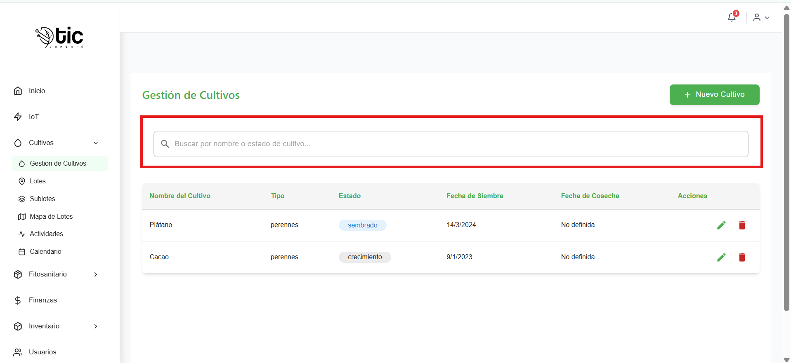
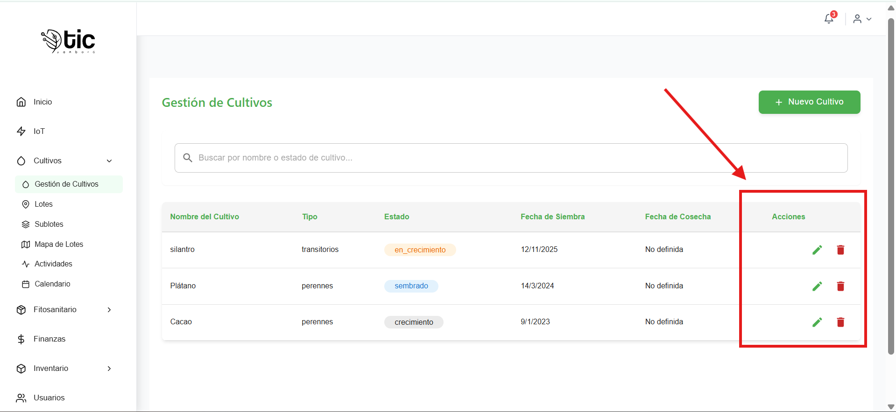
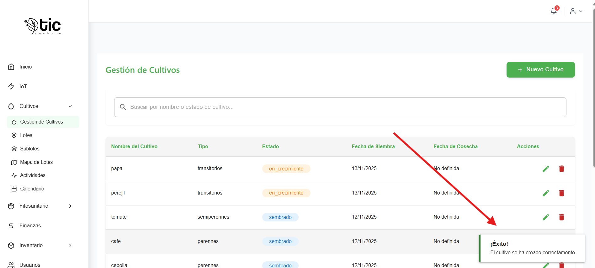
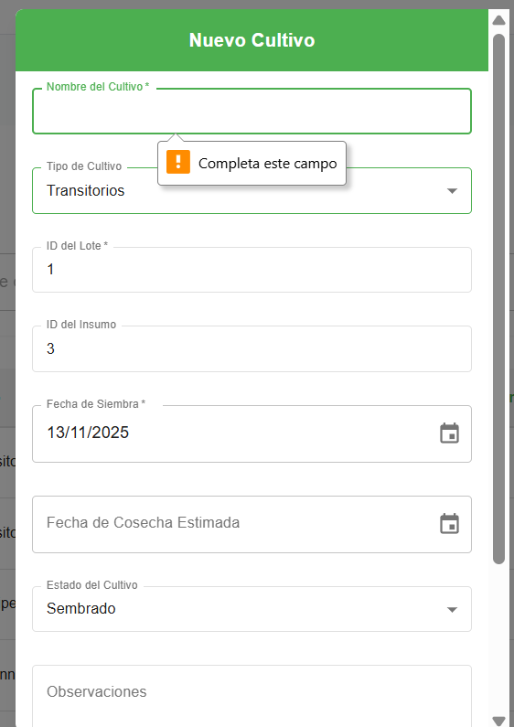

# Módulo de Cultivos
Este documento explica los botones y flujos de la interfaz del módulo de Cultivos en la aplicación web.

## Acceso
- Desde el menú lateral, abre **Cultivos** y selecciona:
  - **Gestión de Cultivos**: lista y administración de cultivos.
  - **Lotes** y **Sublotes**: gestión de ubicaciones.
  - **Mapa de Lotes**: visualización geográfica con un botón para centrar el mapa.
  - **Calendario**: vista por fechas (siembras/actividades relacionadas).

## Gestión de Cultivos
Pantalla principal con título “Gestión de Cultivos” y acciones de búsqueda, creación, edición y eliminación.

### Encabezado
- Botón `Nuevo Cultivo`:
  - Visible para roles: **Administrador** e **Instructor**.
  - Abre un formulario para crear un cultivo.

### Búsqueda
- Campo de búsqueda con ícono de lupa:
  - Filtra por “Nombre del Cultivo” o “Estado” mientras escribes.
  - Texto sugerido: “Buscar por nombre o estado de cultivo...”.

### Tabla de cultivos
- Columnas:
  - `Nombre del Cultivo`
  - `Tipo`
  - `Estado` (se muestra con una etiqueta de color)
  - `Fecha de Siembra`
  - `Fecha de Cosecha`
  - `Acciones` (solo si tienes permisos de edición o eliminación)
- Estado del cultivo con colores:
  - `sembrado` (azul), `en_crecimiento` (naranja), `cosechado` (verde), `perdido` (rojo).

### Acciones por fila
- Botón `Editar` (lápiz):
  - Visible para **Administrador** e **Instructor**.
  - Abre el formulario con los datos del cultivo para actualizar.
- Botón `Eliminar` (papelera):
  - Visible solo para **Administrador**.
  - Abre una confirmación con título “Eliminar Cultivo”.
  - Botones de la confirmación:
    - `Eliminar` (acción peligrosa)
    - `Cancelar`

### Paginación
- Controles de `Página` al final de la lista:
  - Usa las flechas o números para cambiar de página.

### Mensajes y estados
- `Cargando`: se muestra un círculo de progreso mientras se obtiene la lista.
- `Error`: aparece un mensaje en rojo si hubo problemas al cargar.
- `Éxito`: tras crear, actualizar o eliminar verás un aviso de confirmación.

## Formulario: Nuevo/Editar Cultivo
Se abre como un diálogo con dos botones (`Cancelar` y `Crear Cultivo`/`Actualizar`).

### Campos del formulario
- `Nombre del Cultivo` (obligatorio)
- `Tipo de Cultivo` (lista): Transitorios, Perennes, Semiperennes
- `ID del Lote` (obligatorio, número mayor a 0)
- `ID del Insumo` (opcional, número mayor a 0)
- `Fecha de Siembra` (obligatorio)
- `Fecha de Cosecha Estimada` (opcional, no puede ser antes de la siembra)
- `Estado del Cultivo` (lista): Sembrado, En Crecimiento, Cosechado, Perdido
- `Observaciones` (opcional)

### Botones del formulario
- `Cancelar`: cierra el diálogo sin cambios.
- `Crear Cultivo` o `Actualizar`:
  - Guarda los datos y regresa a la lista.
  - Muestra indicador de carga mientras se procesa.

### Validaciones visibles
- Mensajes de ayuda bajo los campos cuando falta información o no es válida.
- En errores del servidor, se muestra un mensaje en la parte superior del diálogo.

## video explicativo de app movil 

- modal de cultivos
<iframe
  style="width: 100%; max-width: 560px; height: auto; aspect-ratio: 16/9;"
  src="https://youtube.com/embed/DvYQ2BMwVMw?si=g2NpIuxC8-5HrZTz
  "
  title="YouTube video  de cultivos"
  frameborder="0"
  allow="accelerometer; autoplay; clipboard-write; encrypted-media; gyroscope; picture-in-picture; web-share"
  allowfullscreen>
</iframe>
