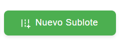
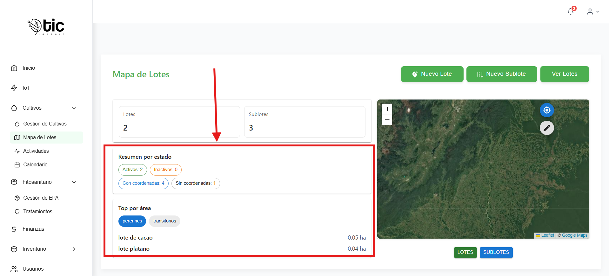
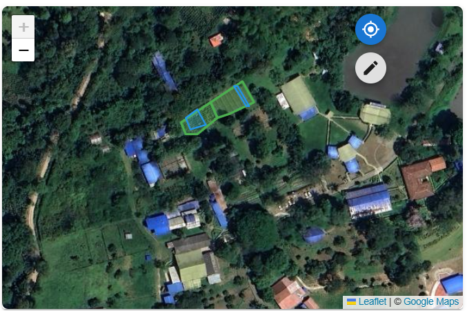
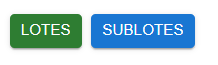
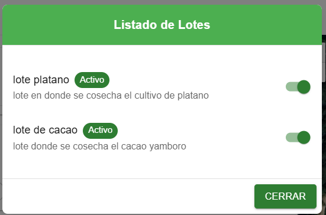
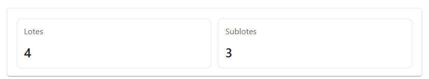

###  Mapa de Lotes 

este sub modulo permite visualizar los lotes y sublotes en un mapa interactivo.

 
### Vista general de la pantalla
- Encabezado con acciones: `Nuevo Lote`, `Nuevo Sublote`, `Ver Lotes`.

- Panel izquierdo con métricas, resumen por estado y “Top por área”.

- Panel derecho con el mapa, popups y acciones flotantes.

- Botones bajo el mapa para mostrar/ocultar `Lotes` y `Sublotes`.

### Botones principales (qué hacen y cuándo usarlos)
- `Nuevo Lote`

  - Abre el formulario para crear un lote.
  
  - Úsalo cuando necesitas registrar un nuevo lote con su información básica.

- `Nuevo Sublote`

  - Abre el formulario para crear un sublote.
  
  - Úsalo para registrar una unidad dentro de un lote existente.

- `Ver Lotes`

  - Muestra una lista de lotes con su estado (Activo/Inactivo).

  - Desde aquí puedes activar o desactivar el estado de un lote con un interruptor.

- `Centrar mapa` (botón flotante con ícono de ubicación)
  - Ajusta la vista del mapa para incluir todas las áreas dibujadas.
  
  - Úsalo para recuperar una vista general cuando estés muy alejado o con zoom.

- `Dibujar/Guardar` (botón flotante con ícono de edición)
  - Permite dibujar un polígono haciendo clic en el mapa y luego abrir un diálogo para guardar.
  - Úsalo para capturar o actualizar las coordenadas de un lote.
  

### Campos y su significado
- Formulario “Nuevo Lote”
  - `Nombre del Lote`: texto obligatorio. Identifica el lote en la interfaz.
  - `Descripción`: texto obligatorio. Breve detalle del lote.
  - `Estado del Lote` (interruptor): indica si el lote está disponible (“Lote disponible”) o no (“Lote ocupado”). No afecta la visibilidad del polígono, sólo su estado.

- Formulario “Nuevo Sublote”
  - `Descripción`: texto obligatorio. Nombre o detalle del sublote.
  - `Ubicación`: texto obligatorio. Referencia del lugar dentro del lote (libre, no es coordenada).
  - `ID del Lote Asociado`: número obligatorio (> 0). Identifica a qué lote pertenece.
  

- Diálogo “Ver Lotes”
  - `Nombre`: nombre del lote.
  - `Descripción`: detalle del lote.
  - `Estado` (chip + interruptor): muestra “Activo” o “Inactivo” y permite cambiarlo.

- Diálogo “Guardar coordenadas” (al usar Dibujar/Guardar)
  - `ID de Lote (opcional)`: si lo indicas, las coordenadas se guardan en ese lote.
  - `Nombre de Lote (si no hay ID)`: si no indicas ID, se crea un lote con este nombre y se guardan allí las coordenadas.
  

### Popups en el mapa
- Popup de Lote
  - Muestra `Nombre` y `Descripción` del lote.
  - Incluye el `Estado` (Activo/Inactivo) y un botón para `Activar` o `Desactivar`.

- Popup de Sublote
  - Muestra `Descripción` y `Ubicación` del sublote.
  - Indica el `Lote` al que pertenece.

### Panel izquierdo: métricas y filtros
- `Lotes` y `Sublotes`: números totales registrados.

- `Resumen por estado`:
  - `Activos` / `Inactivos`: cantidad de lotes por estado.
  - `Con coordenadas` / `Sin coordenadas`: cuántos lotes y sublotes tienen o no polígonos dibujados.
  
- `Top por área`:
  - Chips de filtro por tipo de cultivo (ej. `perennes`, `transitorios`, `semiperennes`).
  - Lista con `Nombre` y `Área` en hectáreas (ha). Se muestra el Top 5.
  

### Reglas y validaciones útiles
- Para crear un Lote: `Nombre` y `Descripción` son obligatorios.
- Para crear un Sublote: `Descripción`, `Ubicación` y `ID del Lote Asociado` son obligatorios; el ID debe ser mayor a 0.
- Para dibujar un polígono válido: necesitas al menos 3 puntos sobre el mapa.
- Al guardar coordenadas:
  - Si proporcionas `ID de Lote`, se guardan en ese lote.
  - Si no proporcionas `ID`, se crea un lote usando `Nombre de Lote` y se guardan allí.

### Flujos rápidos (cómo hacerlo)
- Crear un lote
  - Haz clic en `Nuevo Lote` → completa `Nombre`, `Descripción` y `Estado` → `Crear`.
- Crear un sublote
  - Haz clic en `Nuevo Sublote` → completa `Descripción`, `Ubicación` y `ID del Lote Asociado` → `Crear Sublote`.
- Dibujar y guardar un lote
  - Haz clic en `Dibujar/Guardar` → marca puntos sobre el mapa → `Guardar coordenadas` → indica `ID de Lote` o `Nombre de Lote` → `Guardar`.
- Cambiar estado de un lote
  - Ve a `Ver Lotes` o abre el `Popup` en el mapa → usa el interruptor o botón para `Activar/Desactivar`.
- Filtrar el Top por área
  - En el panel izquierdo, pulsa un chip de tipo de cultivo; pulsa de nuevo para quitar el filtro.
- Mostrar/ocultar entidades en el mapa
  - Usa los botones bajo el mapa: `Lotes` y `Sublotes`.

### consejos de uso
- “Activo/Inactivo” indica disponibilidad operativa del lote, no su visibilidad.
- “Con coordenadas” significa que la entidad tiene un polígono dibujado; “Sin coordenadas” no se dibuja en el mapa.

## video explicativo  de app movil 

- como crear un lote menejo visual de lotes
<iframe
  style="width: 100%; max-width: 560px; height: auto; aspect-ratio: 16/9;"
  src="https://youtube.com/embed/Ko8r5X_DE7U?si=q6lb5j564ByA2poB"
  title="YouTube video mapa de lotes"
  frameborder="0"
  allow="accelerometer; autoplay; clipboard-write; encrypted-media; gyroscope; picture-in-picture; web-share"
  allowfullscreen>
</iframe>
