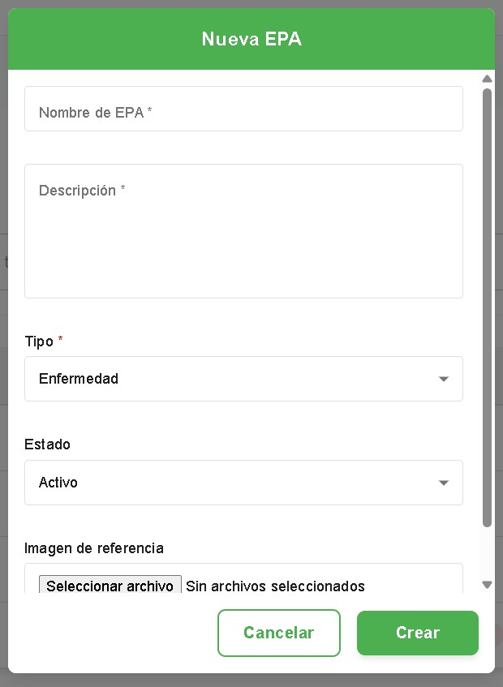
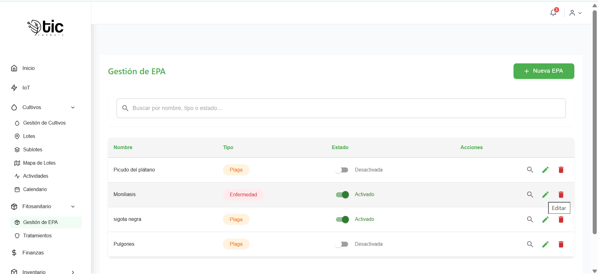

## Gestión de EPA (Enfermedades, Plagas y Arvenses)
Pantalla con título “Gestión de EPA” para crear, buscar, ver detalles, editar, activar/desactivar y eliminar EPAs.

### Encabezado
  - `Nueva EPA` (Administrador/Instructor): abre formulario.

### Búsqueda
  - Filtra por `Nombre`, `Tipo` o `Estado`.
  - Texto sugerido: “Buscar por nombre, tipo o estado...”.

### Tabla de EPAs 
  - Columnas:
    - `Nombre`
    - `Tipo` (etiqueta de color): Enfermedad, Plaga, Arvense
    - `Estado` con interruptor y texto (`Activado`/`Desactivada`)
    - `Acciones`

### Acciones por fila
  - `Ver detalles` (lupa): abre diálogo con información e imagen (si existe). Botón `Cerrar`.
  - `Editar` (lápiz): visible para Administrador e Instructor.
  - `Eliminar` (papelera): confirmación “Eliminar EPA” con `Eliminar` y `Cancelar`.
  - Interruptor de `Estado`: cambia entre `Activo` e `Inactivo` con aviso de éxito/error.

### Formulario: Nueva/Editar EPA
  - `Nombre de EPA` (obligatorio)
  - `Descripción` (obligatorio, multilinea)
  - `Tipo` (lista): Enfermedad, Plaga, Arvense (obligatorio)
  - `Estado` (lista): Activo, Inactivo
  - `Imagen de referencia` (opcional): selector de archivo
  - Botones: `Cancelar` y `Crear`/`Actualizar` (con indicador de carga)
  - Validaciones y mensajes de error.

###  Tutorial paso a paso
  - Crear una EPA
    - Haz clic en `Nueva EPA`.

    - Completa `Nombre`, `Descripción` y selecciona `Tipo`.
    - Opcional: selecciona `Estado` (por defecto suele ser Activo) y añade `Imagen`.

    - Pulsa `Crear`. Verás un mensaje de éxito y la nueva EPA aparecerá en la lista.
  

  - Editar una EPA
    - Localiza la EPA en la tabla y pulsa `Editar`.

    - Cambia los campos necesarios (por ejemplo, `Descripción` o `Tipo`).
    
    - Pulsa `Actualizar`. Verás un mensaje de éxito y los cambios se reflejarán en la tabla.
    
  - Activar/Desactivar una EPA
  
    - Usa el interruptor en la columna `Estado`.

   
    - Pulsa `Cerrar` para salir.
# Miar a una EPA
- Pulsa el icono de la lupa.
    - Revisa la información y la imagen (si existe).

  - Eliminar una EPA
    - Pulsa `Eliminar`.
    - Confirma en el diálogo con `Eliminar` (o `Cancelar` si te arrepientes).
    - Si todo va bien, se mostrará un mensaje de éxito y la fila desaparecerá.

### Paginación y estados
  - Paginación: controles de página al final del listado.
  - `Cargando`: círculo de progreso al obtener datos.
  - `Error`: mensaje en rojo al fallar carga/guardado/estado.
  - `Éxito`: avisos tras crear, actualizar, cambiar estado o eliminar.

## video explicativo de app movil 

- manejo del modulo de epa 
<iframe
  style="width: 100%; max-width: 560px; height: auto; aspect-ratio: 16/9;"
  src="https://youtube.com/embed/m_HlRUgktck?si=MESX0tjWJpHGk-m7"
  title="YouTube vido de epa "
  frameborder="0"
  allow="accelerometer; autoplay; clipboard-write; encrypted-media; gyroscope; picture-in-picture; web-share"
  allowfullscreen>
</iframe>