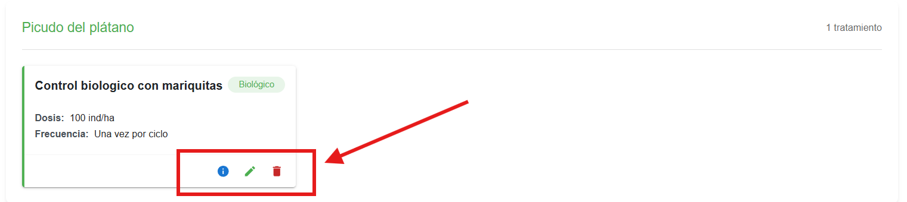
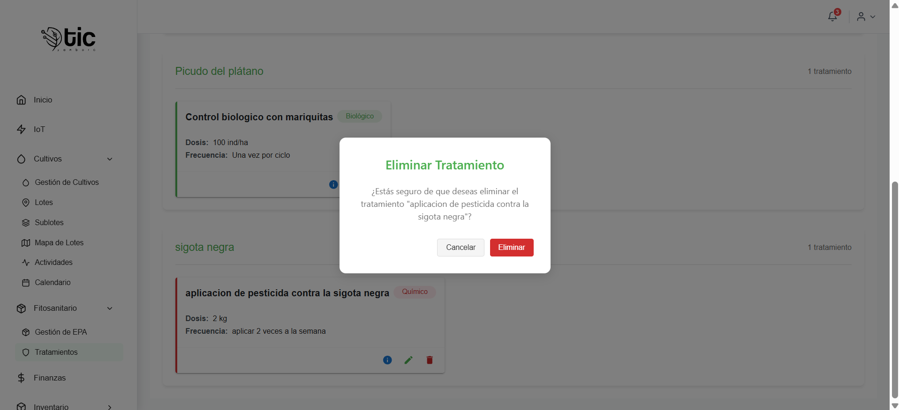
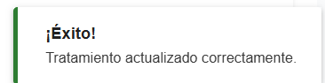

### Gestión de Tratamientos
Pantalla “Tratamientos” para crear, filtrar, ver detalles, editar y eliminar tratamientos vinculados a EPAs.

### Encabezado
  - Título: `Tratamientos`.
  - Botón `Nuevo Tratamiento` (roles: Administrador e Instructor): abre el formulario de creación.

### Filtros y conteo
  - `Filtrar por EPA` (lista): muestra todos los EPAs; filtra por `id_epa`.
  - `Tipo de Tratamiento` (lista): `Biológico` o `Químico`.
  - Contador de resultados: “X tratamiento(s) encontrado(s)”.

### Agrupación y tarjetas
  - Lista agrupada por EPA: encabezado con `epaNombre` y cantidad de tratamientos.
  - Tarjeta de tratamiento por cada elemento:
    - Título: `Descripción`.
    - Chip de `Tipo`: Biológico/Químico (color diferenciado).
    - Campos visibles: `Dosis`, `Frecuencia`.
    
  ## Acciones por tarjeta:
  estas acciones son eliminar mirar y actualizar 
   
# Estados y permisos
  - Sin permisos de vista: mensaje “No tienes permisos para ver tratamientos.
  - `Cargando tratamientos...` durante la carga.
  - `Error al cargar los tratamientos.` con detalle del error.
  - `No hay tratamientos disponibles` y sugerencias según filtros.
  - Permisos:
    - Ver: Administrador, Instructor, Aprendiz, Pasante.
    - Crear/Editar/Eliminar: Administrador e Instructor.

### Confirmación de eliminación
  - Título: `Eliminar Tratamiento`.
  - Mensaje: “¿Estás seguro de que deseas eliminar el tratamiento "<descripcion>"?”.
  - Botones: `Eliminar` y `Cancelar`.

### Título del diálogo: `Nuevo Tratamiento` o `Editar Tratamiento` según corresponda.
- Campos del formulario y validaciones
  - `Descripción` (obligatorio; 1–500 caracteres; multilinea).
  - `Tipo de Tratamiento` (obligatorio; lista): Biológico, Químico.
  - `Dosis` (obligatorio; 1–100 caracteres; ejemplo: 200ml/ha).
  - `Frecuencia` (obligatorio; 1–100 caracteres; ejemplo: Cada 15 días).
  - `EPA` (obligatorio; lista de EPAs cargados).
  - Validación visual: mensajes bajo cada campo cuando no cumple.
  

### Botones
  - `Cancelar`: cierra el diálogo.
  - `Crear`/`Actualizar`: envía el formulario; muestra indicador de carga.
  
### Comportamiento
  - Convierte `id_epa` a número al enviar.
  - En éxito: cierra y muestra “Tratamiento creado/actualizado correctamente.”
  - En error: muestra mensaje de error.

### Título del diálogo: `Detalle de Tratamiento`.
- Contenido
  - `ID` del tratamiento.
  - `Tipo` con chip (Biológico/Químico).
  - `Descripción`, `Dosis`, `Frecuencia`.
  - `EPA` con chip (`epa_nombre` o `id_epa`).

- Botones
  - `Cerrar`: cierra el diálogo.
  
- Tutorial paso a paso
  - Crear un tratamiento
    - Haz clic en `Nuevo Tratamiento`.
    - Completa `Descripción`, `Tipo`, `Dosis`, `Frecuencia` y selecciona `EPA`.
    - Pulsa `Crear`. Verás un aviso de éxito y el tratamiento se agrupa bajo el EPA correspondiente.
  - Editar un tratamiento
    - En la tarjeta del tratamiento, pulsa `Editar`.
    - Modifica los campos necesarios.
    - Pulsa `Actualizar`. Se mostrará un aviso de éxito y los cambios se reflejarán.
  - Ver detalles
    - Pulsa `Ver detalles` en la tarjeta.
    - Revisa los campos en el modal y pulsa `Cerrar`.
  - Eliminar un tratamiento
    - Pulsa `Eliminar` en la tarjeta.
    - Confirma en el diálogo. En caso de éxito, se muestra un aviso y la tarjeta desaparece.

## Consejos de uso
- Si no ves los botones de `Editar` o `Eliminar`, verifica tu rol en la aplicación.
- Usa la búsqueda para encontrar rápido por nombre o por estado.
- Confirma antes de eliminar: el diálogo muestra el nombre del elemento.
- Si una fecha no aparece, la columna muestra “No definida”.

---
¿Quieres que agreguemos capturas de pantalla o un flujo ilustrado dentro del `.md`? Podemos integrarlas y vincular cada botón con su comportamiento esperado.

## video explicativo de app movil 

- manejo del modulo de tratamientos 
<iframe
  style="width: 100%; max-width: 560px; height: auto; aspect-ratio: 16/9;"
  src="https://youtube.com/embed/OMAsDHKgOSY?si=pP_DFjVG-oR7UxmY"
  title="YouTube vido de control de tratamientos "
  frameborder="0"
  allow="accelerometer; autoplay; clipboard-write; encrypted-media; gyroscope; picture-in-picture; web-share"
  allowfullscreen>
</iframe>