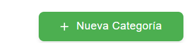
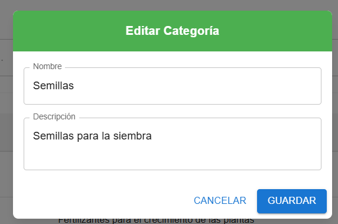

## Gestión de Categorías 

Organiza insumos por categorías para búsquedas y reportes más claros.

### Encabezado y botones
- `Nueva Categoría`: abre el formulario para crear una categoría.

- `Buscar`: filtra por nombre o descripción.

### Tabla de categorías
- Columnas:
  - `ID`: identificador de la categoría.
  - `Nombre`: nombre de la categoría.
  - `Descripción`: detalle u observación.
  - `Acciones`: editar o eliminar (según permisos).

### Acciones por fila
- `Editar`: abre el formulario con datos de la categoría.

- `Eliminar`: muestra confirmación antes de borrar.

### Formulario de Categoría
- Campos: `Nombre`, `Descripción`.
- Botones: `Guardar`, `Cancelar`.

### Pasos rápidos
- Crear: `Nueva Categoría` → completa campos → `Guardar`.

- Editar: botón `Editar` en la fila → ajusta → `Guardar`.

- Eliminar: botón `Eliminar` → confirmar.

### Permisos
- Crear/Editar/Eliminar disponible para roles 
`Administrador` e `Instructor`.

`Aprendiz` e `Pasante`.

## video explicativo de app movil 

- manejo del modulo de categoria 
<iframe
  style="width: 100%; max-width: 560px; height: auto; aspect-ratio: 16/9;"
  src="https://youtube.com/embed/kadcAnR4k5o?si=URe1T3CPGvbN3wLe"
  title="YouTube vido de control financiero "
  frameborder="0"
  allow="accelerometer; autoplay; clipboard-write; encrypted-media; gyroscope; picture-in-picture; web-share"
  allowfullscreen>
</iframe>