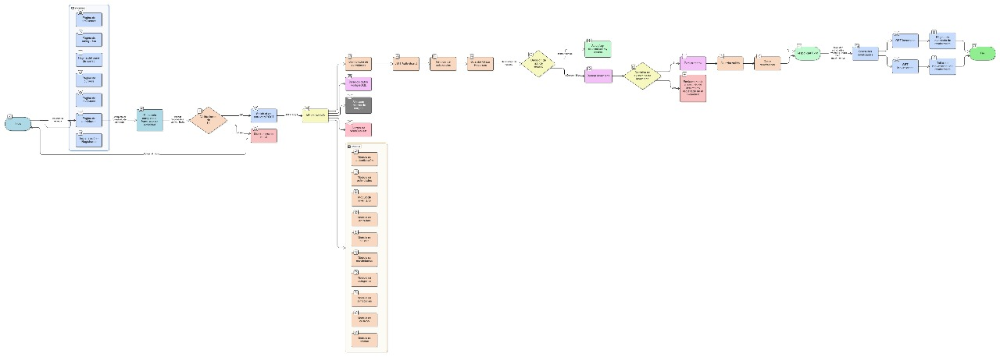

#  AgroTIC 

## Introducción
- AgroTIC es un proyecto construido con NestJS (Node.js) siguiendo una arquitectura modular por dominio.
- Persiste datos en PostgreSQL usando TypeORM (migraciones y seeds).
- Expone API REST, sirve archivos estáticos de subidas y utiliza caché Redis.
- Incluye autenticación con JWT, autorización por roles y permisos, envío de correos (SMTP) y soporte para deep links de recuperación.
- Preparado para ejecución local y contenedores con Docker Compose.

## Arquitectura y módulos
- Núcleo: `AppModule` integra configuración, base de datos, caché, subida/servido de archivos y módulos de dominio.
- Módulos de dominio principales (no exhaustivo): `auth`, `usuarios`, `permisos`, `actividades`, `alertas`, `almacenes`, `cultivos`, `inventario`, `lotes`, `movimientos`, `realiza`, `rol`, `salidas`, `sensores`, `sublotes`, `tiene`, `tiporol`, `tratamientos`, `utiliza`, `finanzas`, `uploads`.
- Patrones por módulo:
  - `controller` expone endpoints REST.
  - `service` contiene lógica de negocio.
  - `entities` define el modelo TypeORM.
  - `dto` valida datos de entrada con `class-validator` y `class-transformer`.
### diagramas 
-diagrama de la arquitectura del proyecto

-diagrama de flujo del proyecto


-diagrama de clases del proyecto


## Entrypoint, Middlewares y CORS
- Entrypoint: `src/main.ts` arranca Nest con `ValidationPipe` global (whitelist/transform/forbidNonWhitelisted).
- Parsers: `body-parser` con límites de 10MB para JSON y URL-encoded.
- Cookies: `cookie-parser` habilitado para lectura/firmado de cookies.
- CORS:
  - Orígenes permitidos derivados de `FRONTEND_URLS` o `FRONTEND_URL`.
  - En desarrollo se agrega `http://localhost:8081` (Expo Web) si no está presente.
  - `credentials: true` activado.

## Configuración global
- `ConfigModule.forRoot({ isGlobal: true, envFilePath: '.env' })` carga variables de entorno.
- Variables relevantes (ver también `docker-compose.yml`):
  - `PORT` (default `3001`)
  - `DB_HOST`, `DB_PORT`, `DB_USERNAME`, `DB_PASSWORD`, `DB_DATABASE`
  - `NODE_ENV` (`development`/`production`)
  - `FRONTEND_URL`, `FRONTEND_URLS` (CORS)
  - `REDIS_HOST`, `REDIS_PORT`
  - `SMTP_USER`, `SMTP_PASS`, `SMTP_HOST`, `SMTP_PORT`
  - `APP_SCHEME` (para generar deep link en correo de recuperación)

## Base de datos (PostgreSQL + TypeORM)
- Fuente de datos: `src/data-source.ts` define `DataSourceOptions` tomando valores de `.env`.
- `TypeOrmModule.forRoot(dataSourceOptions)` inicializa la conexión.
- Migraciones:
  - Directorio en `src/database/migrations` (dev) y `dist/database/migrations` (prod).
  - Scripts en `package.json`:
    - `npm run typeorm:run-migrations`
    - `npm run typeorm:revert-migration`
    - `npm run typeorm:generate-migration`
    - `npm run typeorm:create-migration`
- Seeds:
  - `src/database/seeds` contiene servicios de seeding (ej. `UsuarioSeeder`).
  - `npm run seed` ejecuta `src/seed.ts` para poblar datos iniciales.
- `synchronize: false` en ambos contextos para proteger el esquema.

## Caché (Redis)
- `CacheModule.registerAsync` configura caché con `redisStore` si está disponible, si no, usa caché en memoria.
- TTL por defecto:
  - Redis: 1 hora.
  - Memoria: 1 minuto.
- Variables: `REDIS_HOST`, `REDIS_PORT`.

## Subida y servido de archivos
- `MulterModule` configurado con `diskStorage` en `./uploads`.
- Nombres de archivo con UUID y extensión original.
- `ServeStaticModule` sirve `uploads` bajo el prefijo `/uploads`.
- `UploadsController` expone endpoints públicos para devolver imágenes específicas:
  - `GET /uploads/epa/:filename`
  - `GET /uploads/actividades/:filename`
- Nota: el frontend `vite` incluye un proxy para `/uploads` en desarrollo.

## Autenticación y autorización
- JWT:
  - `AuthModule` registra `JwtModule` con `secret` y `expiresIn: '1h'`.
  - `JwtStrategy` y `JwtAuthGuard` protegen rutas.
- Roles y permisos:
  - Decoradores: `@Roles(...)` para roles, `@Public()` para rutas públicas.
  - `RolesGuard` valida rol.
  - Módulo `permisos` maneja permisos granularmente (`clave`, `recurso`, `accion`).
- Buenas prácticas recomendadas:
  - Mover el `secret` de JWT a `.env` (no hardcodear en código).
  - Rotación de tokens y refresh si aplica al negocio.

## Correo y recuperación de contraseña
- `EmailService` compone enlaces de reset:
  - Web: `${FRONTEND_URL}/reset-password?token=...`.
  - App (deep link): `${APP_SCHEME}://reset-password?token=...` (por defecto `agrotic`).
- Si faltan credenciales SMTP, el sistema simula envío y loguea los enlaces.
- Flujo en `AuthService`:
  - `POST /auth/forgot-password`: genera `token` y `expiresAt`, guarda en el usuario y envía correo.
  - `POST /auth/reset-password`: valida token, expira si corresponde, hashea nueva contraseña y limpia token.

## WebSockets y alertas
- `AlertasModule` usa `@nestjs/websockets` y `@nestjs/platform-socket.io` para notificar eventos.
- Integra `MailerService` y `Cache` donde aplica.

## Scheduling
- `ScheduleModule.forRoot()` habilitado para tareas programadas (cron/intervalos) usadas en módulos que lo requieran.

## Testing
- Unit/E2E con Jest:
  - `npm run test` / `npm run test:e2e`.
  - Config Jest en `package.json` (`rootDir: src`, `ts-jest`).

## Docker y despliegue
- `docker-compose.yml` define servicios:
  - `api` (Nest): mapea `PORT` y carga `.env`. Dependencias: `postgres`, `redis`.
  - `postgres`: imagen `postgis/postgis:15-3.4`, usa `postgres_data`.
  - `redis`: imagen `redis:alpine`, usa `redis_data`.
- Variables por servicio se resuelven desde `.env` o defaults del compose.
- Comandos típicos:
  - `docker compose up -d` para levantar todo.
  - `docker compose logs -f api` para ver logs.

## Scripts útiles (package.json)
- Desarrollo:
  - `npm run start:dev` → arranque con watch.
  - `npm run lint` / `npm run format`.
- Producción:
  - `npm run build` → compila a `dist/`.
  - `npm run start:prod` → ejecuta `dist/main.js`.
- BD:
  - `npm run typeorm:run-migrations` / `revert-migration`.
  - `npm run seed`.

## Variables de entorno (referencia)
```env
PORT=3001
NODE_ENV=development
DB_HOST=localhost
DB_PORT=5432
DB_USERNAME=postgres
DB_PASSWORD=123789
DB_DATABASE=api_proyecto
FRONTEND_URL=http://localhost:3000
FRONTEND_URLS=http://localhost:3000,http://localhost:8081
REDIS_HOST=localhost
REDIS_PORT=6379
SMTP_HOST=smtp.gmail.com
SMTP_PORT=587
SMTP_USER=
SMTP_PASS=
APP_SCHEME=agrotic
```

## Seguridad y mejores prácticas
- Mover secretos a `.env` y usar `ConfigModule` para inyectarlos (JWT secret, SMTP credenciales).
- Mantener `synchronize=false`; gestionar cambios con migraciones.
- Restringir CORS a dominios válidos en producción.
- Validar y sanear payloads con DTOs + `ValidationPipe` (ya habilitado globalmente).
- Publicar archivos estáticos exclusivamente bajo rutas controladas.

## Puesta en marcha
- Local (sin Docker):
  - Crear `.env` con valores locales.
  - `npm i`
  - Levantar Postgres y Redis (local o contenedores).
  - `npm run typeorm:run-migrations`
  - `npm run seed` (opcional)
  - `npm run start:dev`
- Con Docker:
  - Completar `.env`.
  - `docker compose up -d`
  - La API quedará en `http://localhost:${PORT}`.

## Integración con apps cliente
- Frontend web: Vite React, con proxy a `/uploads` en desarrollo.
- App móvil (Expo): utiliza `EXPO_PUBLIC_API_URL` para apuntar a la API y deep links `agrotic://` para recuperación; cuando se configure dominio real se habilitarán App Links con HTTPS.


